# xSTUDIO - Professional Media Review and Playback Application

<div align="center">


**A high-performance media playback and review application for film and TV post-production**

[](LICENSE)
[](#building-xstudio)
[](https://isocpp.org/)
[](https://python.org/)

</div>

## 🎬 What is xSTUDIO?

xSTUDIO is a cutting-edge media playback and review application designed specifically for professionals in the **Visual Effects**, **Feature Animation**, and **Film/TV Post-Production** industries. Built with performance at its core, xSTUDIO provides an intuitive interface backed by a robust C++ engine and comprehensive Python APIs for seamless pipeline integration.

### 🌟 Key Features

- **🚀 High-Performance Playback Engine** - Optimized for large media files and high-resolution formats
- **🎨 Professional Review Tools** - Advanced color management, annotations, and comparison tools
- **📊 Timeline & Playlist Management** - Sophisticated media organization and playlist creation
- **🔌 Extensible Plugin Architecture** - Custom plugins for specialized workflows
- **🐍 Python API Integration** - Complete Python SDK for pipeline automation
- **🌐 Multi-Platform Support** - Linux, Windows (macOS coming soon)
- **👥 Collaborative Features** - Session sharing and remote control capabilities
- **📝 Comprehensive Annotation System** - Drawing tools, notes, and markup features

### 🎯 Target Users

- **VFX Artists & Supervisors** - Review shots, compare versions, annotate feedback
- **Animation Directors** - Timeline scrubbing, frame-by-frame analysis
- **Post-Production Teams** - Collaborative review sessions, playlist management  
- **Pipeline Engineers** - Python API integration, custom tool development

## 🏗️ Architecture Overview

xSTUDIO is built on a sophisticated **actor-based architecture** using the C++ Actor Framework (CAF), providing excellent scalability, thread safety, and modularity.

### Core Architecture Diagram


### Actor Communication Pattern


### Plugin Architecture

```mermaid
graph LR
    subgraph "Plugin Types"
        CO[Color Operations<br/>• Grading<br/>• LUTs<br/>• Effects]
        MR[Media Readers<br/>• FFmpeg<br/>• OpenEXR<br/>• Custom Formats]
        VO[Viewport Overlays<br/>• HUD Elements<br/>• Annotations<br/>• Masks]
        DS[Data Sources<br/>• Shotgun<br/>• Database<br/>• File Systems]
        MH[Media Hooks<br/>• Pipeline Integration<br/>• Custom Processing]
    end

    subgraph "Plugin System"
        PM[Plugin Manager]
        PF[Plugin Factory]
        PL[Plugin Loader]
    end

    subgraph "Core System"
        VP[Viewport]
        MP[Media Pipeline]
        UI[User Interface]
    end

    PM --> PF
    PM --> PL
    PF --> CO
    PF --> MR
    PF --> VO
    PF --> DS
    PF --> MH
    
    VP --> CO
    VP --> VO
    MP --> MR
    MP --> MH
    UI --> DS

    style PM fill:#e3f2fd
    style VP fill:#f1f8e9
    style MP fill:#fce4ec
```



## 🚀 Quick Start Guide

### Prerequisites

**System Requirements:**
- **Linux**: Ubuntu 22.04+, CentOS 7+, Rocky Linux 9.1+
- **Windows**: Windows 10/11 with Visual Studio 2019+
- **Hardware**: OpenGL 3.3+, 8GB+ RAM recommended
- **Dependencies**: CMake 3.12+, Qt5.15+, Python 3.8+

### Building from Source

#### 1. Clone the Repository
```bash
git clone https://github.com/AcademySoftwareFoundation/xstudio.git
cd xstudio
```

#### 2. Install Dependencies

**Ubuntu 22.04:**
```bash
sudo apt install build-essential cmake git python3-pip
sudo apt install qtbase5-dev qtdeclarative5-dev qtquickcontrols2-5-dev
sudo apt install libspdlog-dev libfmt-dev libssl-dev zlib1g-dev
sudo apt install libglu1-mesa-dev libglew-dev libfreetype-dev
sudo apt install libjpeg-dev libpulse-dev nlohmann-json3-dev
```

**See detailed platform-specific instructions:**
- [Ubuntu 22.04](docs/build_guides/ubuntu_22_04.md)
- [CentOS 7](docs/build_guides/centos_7.md)
- [Rocky Linux 9.1](docs/build_guides/rocky_linux_9_1.md)
- [Windows](docs/build_guides/windows.md)

#### 3. Build xSTUDIO
```bash
mkdir build && cd build
cmake .. -DCMAKE_BUILD_TYPE=Release
make -j$(nproc)
```

#### 4. Run xSTUDIO
```bash
./bin/xstudio.bin
```

### Docker Setup

For containerized development:

```bash
# Build Docker image
docker build -t xstudio .

# Enable X11 forwarding (Linux)
sudo xhost +local:root

# Run container with GPU support
docker run --rm -it --gpus all \
  -v /tmp/.X11-unix:/tmp/.X11-unix \
  -e DISPLAY=$DISPLAY \
  xstudio bash

# Launch xSTUDIO inside container
./build/bin/xstudio.bin
```

## 👨‍💻 Developer Guide

### Project Structure

```
xstudio/
├── src/                     # Core C++ source code
│   ├── global/             # Global actor and system coordination
│   ├── studio/             # Top-level application container
│   ├── session/            # Project/session management
│   ├── media/              # Media handling and sources
│   ├── playhead/           # Playback control and timeline
│   ├── playlist/           # Media organization
│   ├── ui/                 # User interface components
│   │   ├── qml/           # QML UI components
│   │   ├── opengl/        # OpenGL rendering
│   │   └── viewport/      # Main viewport implementation
│   ├── plugin/             # Plugin implementations
│   │   ├── colour_op/     # Color operation plugins
│   │   ├── media_reader/  # Media format readers
│   │   ├── data_source/   # External data integration
│   │   └── viewport_overlay/ # HUD and overlay plugins
│   └── utility/            # Core utilities and helpers
├── include/xstudio/        # Public header files
├── python/                 # Python API and bindings
├── ui/qml/                # QML interface files
├── share/                  # Configuration and resources
└── docs/                   # Documentation
```

### Key Components Deep Dive

#### 1. Actor System
The core of xSTUDIO is built on the **C++ Actor Framework (CAF)**:

```cpp
// Example: Creating an actor
class MyActor : public caf::event_based_actor {
public:
    MyActor(caf::actor_config& cfg) : caf::event_based_actor(cfg) {
        behavior_.assign(
            [=](play_atom) {
                // Handle play command
                send(playhead_, play_atom_v);
            }
        );
    }
    
    caf::behavior make_behavior() override { return behavior_; }
private:
    caf::behavior behavior_;
    caf::actor playhead_;
};
```

#### 2. Media Pipeline
Media processing follows this flow:


#### 3. Plugin Development

**Creating a Color Operation Plugin:**

```cpp
class MyColorOp : public plugin::ColourOpPlugin {
public:
    MyColorOp(caf::actor_config& cfg) : ColourOpPlugin(cfg) {}
    
    // Implement color transformation
    void apply_colour_operation(
        ImageBufPtr& image,
        const ColourOperationDataPtr& op_data
    ) override {
        // Your color processing here
        process_pixels(image->buffer(), op_data);
    }
    
private:
    void process_pixels(uint8_t* pixels, const ColourOperationDataPtr& data);
};

// Register plugin
extern "C" {
    plugin::PluginFactoryPtr plugin_factory() {
        return std::make_shared<plugin::PluginFactory>(
            plugin::PluginType::ColourOp,
            "MyColorOp",
            []() { return std::make_shared<MyColorOp>(); }
        );
    }
}
```

### Building New Features

#### 1. Adding a New Actor

1. **Create header file** in `include/xstudio/myfeature/`:
```cpp
class MyFeatureActor : public caf::event_based_actor {
public:
    MyFeatureActor(caf::actor_config& cfg);
    caf::behavior make_behavior() override;
private:
    caf::behavior behavior_;
};
```

2. **Implement in** `src/myfeature/src/`:
```cpp
MyFeatureActor::MyFeatureActor(caf::actor_config& cfg) 
    : caf::event_based_actor(cfg) {
    
    // Register with system
    system().registry().put("MYFEATURE", this);
    
    behavior_.assign(
        [=](my_action_atom, const std::string& data) {
            // Handle your custom message
            return process_action(data);
        }
    );
}
```

3. **Add CMakeLists.txt** and **integrate with build system**

#### 2. Creating UI Components

**QML Component:**
```qml
// MyFeaturePanel.qml
import QtQuick 2.15
import QtQuick.Controls 2.15
import xStudio 1.0

Rectangle {
    id: root
    
    property alias myFeatureModel: model
    
    MyFeatureModel {
        id: model
        backend: app_window.session
    }
    
    Column {
        Button {
            text: "My Action"
            onClicked: model.performAction()
        }
        
        ListView {
            model: model
            delegate: Text { text: model.displayName }
        }
    }
}
```

**C++ Backend Model:**
```cpp
class MyFeatureModel : public QAbstractListModel {
    Q_OBJECT
public:
    explicit MyFeatureModel(QObject* parent = nullptr);
    
    Q_INVOKABLE void performAction();
    
    // QAbstractListModel interface
    int rowCount(const QModelIndex& parent) const override;
    QVariant data(const QModelIndex& index, int role) const override;
    
private:
    caf::actor backend_;
    std::vector<MyData> data_;
};
```

### Testing Your Changes

#### Unit Tests
```bash
# Build with testing enabled
cmake .. -DBUILD_TESTING=ON
make -j$(nproc)

# Run specific tests
./src/myfeature/test/myfeature_test

# Run all C++ tests
make test
```

#### Python API Tests
```bash
cd python/test
pytest test_myfeature.py -v
```

#### Integration Testing
```bash
# Start xSTUDIO in test mode
./bin/xstudio.bin --session test_session -e -n

# Run Python integration tests
python integration_test.py
```

### Code Style and Standards

#### C++ Guidelines
- **Modern C++17** features encouraged
- **RAII** patterns for resource management
- **Smart pointers** over raw pointers
- **const-correctness** throughout
- **CAF message passing** for actor communication

#### Formatting
```bash
# Format C++ code (if enabled)
ninja clangformat

# Check with clang-tidy
ninja clang-tidy
```

#### Commit Guidelines
```bash
# Example commit message
git commit -m "feat(playhead): add frame-accurate seeking

- Implement sub-frame positioning
- Add timeline scrubbing support
- Update playback controls UI
- Add unit tests for seek accuracy

Closes #123"
```

## 🔌 Python API

The Python API provides complete access to xSTUDIO's functionality:

### Basic Usage

```python
import xstudio

# Connect to running xSTUDIO instance
connection = xstudio.Connection()
connection.connect_remote("localhost", 45500)

# Create new session
session = connection.create_session("My Project")

# Add media to playlist
media = session.create_media("/path/to/video.mov")
playlist = session.create_playlist("Shots")
playlist.add_media(media)

# Control playback
playhead = session.playhead
playhead.play()
playhead.seek_to_frame(100)

# Add annotations
annotation = session.create_annotation("Review note")
annotation.set_frame(100)
annotation.set_text("Fix this shot")
```

### Advanced Pipeline Integration

```python
# Custom media processing pipeline
class RenderReviewPipeline:
    def __init__(self, xstudio_connection):
        self.xs = xstudio_connection
        
    def process_shots(self, shot_list):
        session = self.xs.create_session("Render Review")
        
        for shot in shot_list:
            # Create media from render path
            media = session.create_media(shot.render_path)
            
            # Apply color correction
            if shot.lut_path:
                media.apply_lut(shot.lut_path)
                
            # Add to appropriate playlist
            playlist = session.get_playlist(shot.sequence)
            playlist.add_media(media)
            
            # Auto-generate thumbnails
            media.generate_thumbnail()
            
        return session
```

### CLI Tools

```bash
# Control running xSTUDIO instance
xstudio-control --host localhost --port 45500 \
    --command "session.playhead.play()"

# Inject Python scripts
xstudio-inject --script my_pipeline.py

# Batch operations
xstudio-control --batch << EOF
session = create_session("Batch")
for f in glob.glob("*.mov"):
    add_media(f)
EOF
```

## 🔧 Configuration & Customization

### Preferences System

xSTUDIO uses JSON-based configuration stored in `share/preference/`:

```json
// core_playhead.json
{
    "playback": {
        "fps": 24.0,
        "loop_mode": "LOOP",
        "audio_enabled": true
    },
    "cache": {
        "max_frames": 1000,
        "preroll_frames": 10
    }
}
```

### Custom Hotkeys

```json
// ui_viewport.json
{
    "hotkeys": {
        "space": "play_pause",
        "j": "step_backward", 
        "k": "step_forward",
        "home": "go_to_start",
        "end": "go_to_end"
    }
}
```

### Plugin Configuration

```json
// plugin_color_pipeline_ocio.json
{
    "ocio_config": "/studio/config/aces_1.2/config.ocio",
    "default_view": "sRGB",
    "working_space": "ACEScg"
}
```

## 🐛 Troubleshooting

### Common Issues

#### Build Problems

**CMake can't find Qt5:**
```bash
# Set Qt5 path explicitly
export CMAKE_PREFIX_PATH=/usr/lib/x86_64-linux-gnu/cmake/Qt5
```

**Missing OpenGL drivers:**
```bash
# Install Mesa drivers (Ubuntu)
sudo apt install mesa-utils libgl1-mesa-dev

# Test OpenGL
glxinfo | grep "direct rendering"
```

#### Runtime Issues

**xSTUDIO won't start:**
```bash
# Check dependencies
ldd ./bin/xstudio.bin

# Run with debug logging
./bin/xstudio.bin --log-level debug --log-file xstudio.log
```

**Poor playback performance:**
```bash
# Check GPU usage
nvidia-smi  # For NVIDIA GPUs
glxinfo | grep "renderer"

# Adjust cache settings in preferences
# Increase memory limits in core_cache.json
```

**Plugin loading fails:**
```bash
# Check plugin paths
export XSTUDIO_PLUGIN_PATH=/path/to/plugins

# Verify plugin dependencies
ldd /path/to/plugin.so
```

### Debug Mode

```bash
# Enable debug features
cmake .. -DCMAKE_BUILD_TYPE=Debug -DBUILD_TESTING=ON

# Run with debugger
gdb ./bin/xstudio.bin
(gdb) run --log-level debug
```

### Log Analysis

```bash
# View log files
tail -f xstudio.log

# Filter specific components
grep "MediaReader" xstudio.log
grep "ERROR" xstudio.log
```

## 🤝 Contributing

We welcome contributions! Here's how to get started:

### Development Setup

1. **Fork the repository** and clone your fork
2. **Create a feature branch**: `git checkout -b feature/my-feature`
3. **Set up development environment**:
   ```bash
   mkdir build-dev && cd build-dev
   cmake .. -DCMAKE_BUILD_TYPE=Debug -DBUILD_TESTING=ON
   make -j$(nproc)
   ```

### Contribution Guidelines

- **Follow the coding standards** (see [CONTRIBUTING.md](CONTRIBUTING.md))
- **Write comprehensive tests** for new features
- **Update documentation** for API changes
- **Sign the CLA** (required for all contributions)

### Pull Request Process

1. **Ensure all tests pass**: `make test && pytest python/test/`
2. **Run code formatting**: `ninja clangformat`
3. **Update CHANGELOG.md** with your changes
4. **Create detailed PR description** with:
   - What the change does
   - Why it's needed
   - How to test it
   - Any breaking changes

## 📚 Documentation

- **[User Guide](share/docs/index.html)** - Complete user documentation
- **[API Reference](docs/api/)** - C++ API documentation
- **[Python API](docs/python_api/)** - Python bindings documentation
- **[Build Guides](docs/build_guides/)** - Platform-specific build instructions
- **[Plugin Development](docs/plugin_dev.md)** - Creating custom plugins

## 📄 License

xSTUDIO is licensed under the [Apache License 2.0](LICENSE).

## 🙏 Acknowledgments

- **Academy Software Foundation** for project stewardship
- **DNEG** for the original development and open-sourcing
- **Contributors** who have helped improve xSTUDIO
- **Open-source projects** that xSTUDIO builds upon:
  - [C++ Actor Framework (CAF)](https://actor-framework.org/)
  - [Qt Framework](https://qt.io/)
  - [OpenEXR](https://openexr.com/)
  - [FFmpeg](https://ffmpeg.org/)
  - [pybind11](https://pybind11.readthedocs.io/)

## 📞 Support

- **GitHub Issues**: [Report bugs or request features](https://github.com/AcademySoftwareFoundation/xstudio/issues)
- **Discussions**: [Community discussions](https://github.com/AcademySoftwareFoundation/xstudio/discussions)
- **Documentation**: [User guides and API docs](docs/)

---

<div align="center">

**Built with ❤️ for the Film & VFX Community**

[🌟 Star us on GitHub](https://github.com/AcademySoftwareFoundation/xstudio) | [🐛 Report Issues](https://github.com/AcademySoftwareFoundation/xstudio/issues) | [💬 Discussions](https://github.com/AcademySoftwareFoundation/xstudio/discussions)

</div>