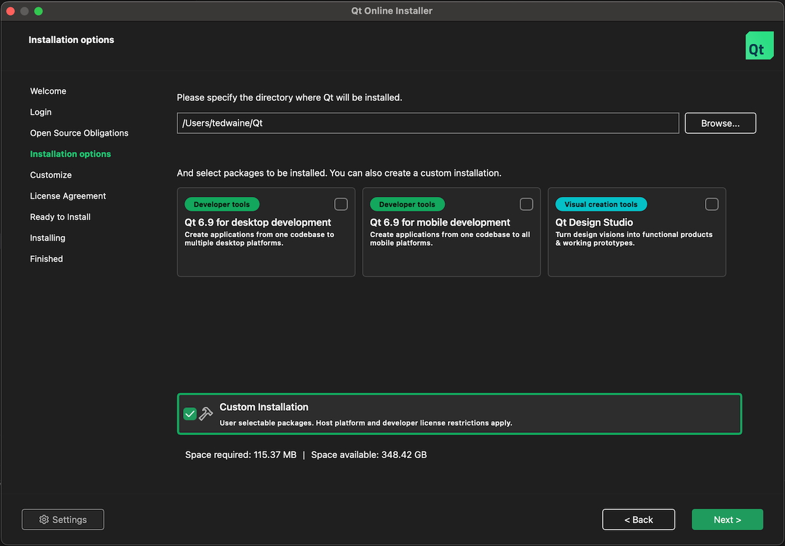
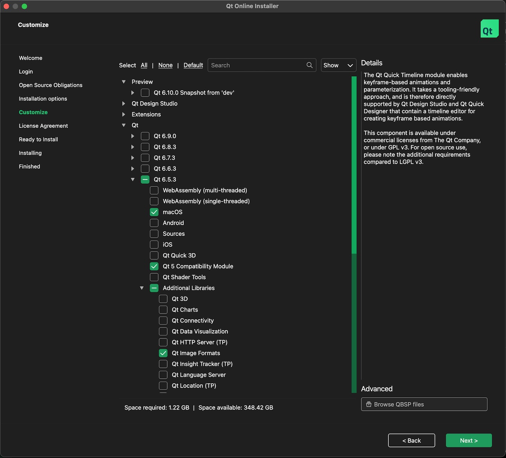

## Downloading Qt SDK

xSTUDIO's UI is built with the Qt cross-platform GUI development libraries. The Qt SDK is a major dependency that is required to build xSTUDIO but fortunately it is freely available for public use under the GPL license.

There are two ways to install it: the official Qt installer (GUI, requires a Qt account), or `aqtinstall` (command-line, scriptable, no account). Either produces the same result and both are documented below — pick whichever you prefer.

### Option A: Using `aqtinstall` (command-line, recommended)

[`aqtinstall`](https://github.com/miurahr/aqtinstall) is a small open-source Python tool that downloads the same official Qt prebuilt binaries as the GUI installer, directly from Qt's CDN. It requires no Qt account, is fully scriptable, and installs exactly the version and modules you ask for.

First, make sure you have Python 3 and `pip` available, then install `aqtinstall`:

    pip install aqtinstall

Then download Qt 6.5.3 for your platform. Choose the command that matches your OS:

    # Linux (gcc x86_64)
    aqt install-qt linux desktop 6.5.3 gcc_64 -O ~/Qt -m qtimageformats

    # macOS (universal: ARM + Intel)
    aqt install-qt mac desktop 6.5.3 clang_64 -O ~/Qt -m qtimageformats

    # Windows (MSVC 2019 64-bit, in PowerShell)
    aqt install-qt windows desktop 6.5.3 win64_msvc2019_64 -O C:\Qt -m qtimageformats

The `-m qtimageformats` flag installs the extra 'Qt Image Formats' module that xSTUDIO requires. The `-O` flag specifies the output directory — feel free to change it, but make a note of the path as you will need it later when setting `Qt6_DIR` in your build environment.

After the command finishe, you will have a Qt installation layout identical to what the GUI installer produces, e.g. `~/Qt/6.5.3/gcc_64/` on Linux, `~/Qt/6.5.3/macos/` on macOS, or `C:\Qt\6.5.3\msvc2019_64\` on Windows.

### Option B: Running the Qt installer (GUI)

First you need to download the [Qt Installer](https://www.qt.io/download-qt-installer).

Run the installer app. Before you can proceed you must register with Qt if you aren't already and then log-in with your credentials when the installer requests you to do so. Agree to the terms and conditions and hit 'Next'. You are then presented with a panel with options about which developer tools to download. ***Ensure that Custom Installation is checked and all other options are not checked.*** . Choose a destination location on your filesystem for the Qt modules to be installed to (Where it says 'Please specify the directory where QT will be installed'). Make a note of this location as you will need it later. Now hit 'Next'.

#### Select Qt 6.5.3 components (Option B only)

Now you must select the correct version of Qt to download. The required version is **6.5.3**. Epand the 'Qt' item in the list, then expand the Qt 6.5.3 below that. You only need to check the following option within the list under 6.5.3, depending on your platform:

* Apple: **macOS**
* Windows: **MSVC 2019 64-bit**
* Linux: **gcc_64**

You must also expand the 'Addition Libraries' item, and select **'Qt Image Formats'** from that list.

The following screengrab was done when downloading onto an Apple Mac machine. If you're on Windows it will look slightly different and you must check 'MSVC 2019 64-bit'.

Now You can hit the Next button and continue. Agree to the license terms and continue to the final page where you must hit the **Install** button. Note that the Qt components that we need are more than 1Gb in size, so may take some time to download depending on you connection and geographical location.