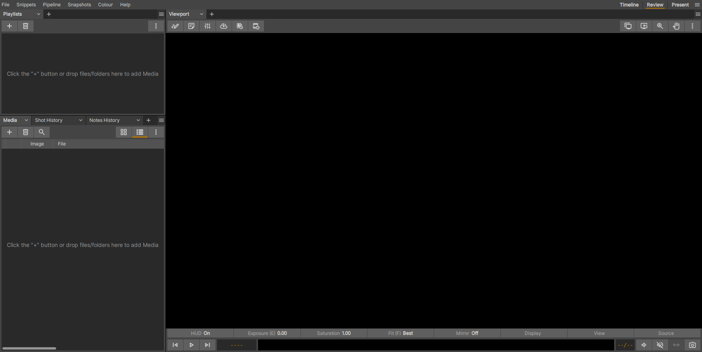

.. _getting_started:

#####################
Getting Started
#####################

Building xSTUDIO
----------------

Follow the :ref:`build guide documentation <build_guides>` for platform-specific
instructions on building xSTUDIO.

Launching xSTUDIO
-----------------

How you launch xSTUDIO depends on how it was installed, but the common cases
are:

* Linux
    On most Linux desktops, launch an empty xSTUDIO session by typing
    ``xstudio`` in a terminal.

    If xSTUDIO is already running, the `xstudio` command normally talks to the
    existing instance instead of opening a second UI. This is how xSTUDIO's
    media *push* workflow works. To force a new GUI session, use
    ``xstudio -n``.
* Windows
    The Windows installer should add a shortcut to the Start menu.
* macOS
    xSTUDIO is typically installed as an application bundle. Launch it by
    opening the app in Finder, or from a shell using the app bundle's
    executable path.

Loading Media (filesystem browser)
----------------------------------

The fastest way to start reviewing media is to drag files or folders into the
main window. If you drop a folder, xSTUDIO recursively searches it for media
that it can load.

There are three common drag-and-drop targets:

  - The empty space of the Playlists panel. This creates a new playlist and
    adds the dropped media.
  - An existing playlist entry in the Playlists panel. This adds the dropped
    media to that playlist.
  - The Media List panel. This appends the dropped media to the container that
    is currently being inspected there.

If the top-level folder you drop contains subfolders, xSTUDIO can represent
those as *subsets* beneath the new playlist.

.. raw:: html

    
<video src="../../_static/drag-drop1.webm" width="720" height="366" controls></video>

|

.. _command_line_loading:

Loading Media (command line)
----------------------------

Media can also be loaded from a terminal. By default, if xSTUDIO is already
running, command-line paths are added to the existing session instead of
starting a new UI. Use `-n` if you explicitly want a new session.

xSTUDIO supports a mix of individual files, wildcard patterns, directories, and
frame-sequence patterns in the same command:

.. code-block:: bash

    xstudio /path/to/test.mov /path/to/\*.jpg /path/to/frames.####.exr=1-10 /path/to/other_frames.####.exr

On Windows your command might look like this:

.. code-block:: bash

    C:\Program Files\xSTUDIO\bin\xstudio.exe C:\Users\JaneSmith\Media\test_movie.mp4 C:\Users\JaneSmith\Media\exrs\exr_sequence.####.exr

On macOS you will usually call the executable inside the app bundle, for
example:

.. code-block:: bash

    /Applications/xSTUDIO.app/Contents/MacOS/xstudio.bin /Users/joe/Downloads/imported_media

A specific subset of frames can be loaded, or you can omit the range to load
all frames that match the pattern.

.. note::
     Passing a filesystem directory rather than a file path means the directory
     will be recursively searched for media that can be loaded into xSTUDIO.
.. note::
     Movie files are played back at their encoded frame rate.
.. note::
    Image sequences default to 24 fps unless you change the preference.

For more details on command-line loading and scripting, see the appendix
sections on media items and Python scripting.

Viewing Media
-------------

If you drag media directly into the Media List, the first item dropped is shown
immediately. Use the up and down arrow keys to cycle through the viewed media.

If you drag media into the Playlists panel instead, the media is added to the
session but not automatically shown in the viewport. To start viewing it,
double-click the playlist you just created.

.. note::
    The Media List panel shows the contents of the *selected* container. The
    *selected* container can be different from the *viewed* container that is
    currently driving the viewport.

Single-click a playlist to select it. Double-click a playlist to select it and
switch the viewport to that container.

If your selected playlist is already the viewed playlist, single-clicking a
media item in the Media List shows it in the viewport. The arrow-key shortcuts
remain the fastest way to step through nearby items.

If your selected playlist is not the viewed playlist, double-clicking a media
item switches the viewed playlist and starts playing that item.

.. _creating_a_sequence:

Creating a Sequence (Timeline)
------------------------------

To create a multi-track edit, start with a playlist. Sequences are children of
playlists. With a playlist selected, right-click it or use the *More* button in
the Playlists panel and choose *New Sequence*.

Once a sequence exists, populate it by dragging media from the parent playlist
into the timeline. You can also drag new media directly into the Media List
while the sequence is selected.

.. note::
    Media can be loaded into a sequence without already being placed in the
    edit. In that sense, a sequence acts as both a timeline and its own local
    media bin. Media loaded into the sequence appears in the Media List and can
    then be dragged into timeline tracks.

This short video demonstrates sequence creation.

.. raw:: html

    
<video src="../../_static/building-timeline-01.webm" width="720" height="366" controls></video>

