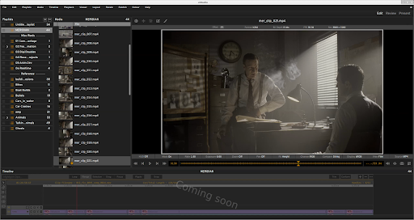

.. _user_docs:

###################
xSTUDIO User Guide
###################

.. note::
     The screenshots included in this user guide include some visual content
     from the 'Meridian' title, part of the `Netflix Open Content <https://opencontent.netflix.com/>`_
     media data set.

This guide describes the current xSTUDIO 1.1.x workflow model: sessions,
playlists, media inspection, compare modes, sequences, notes, grading, and
pipeline scripting. Some screenshots were captured on earlier builds, but the
terminology and workflow descriptions below have been refreshed against the
current repository.

.. toctree::
   :maxdepth: 2

   overview
   ./getting_started/getting_started
   ./interface/interface
   ./workflow/workflow
   ./appendix/index
   ./release_notes/index
