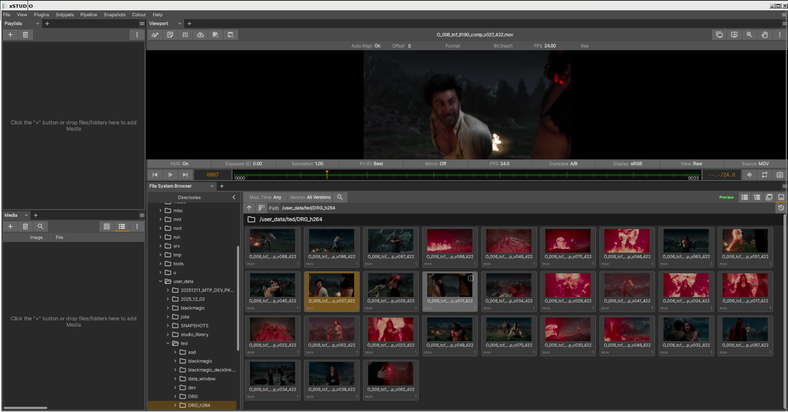
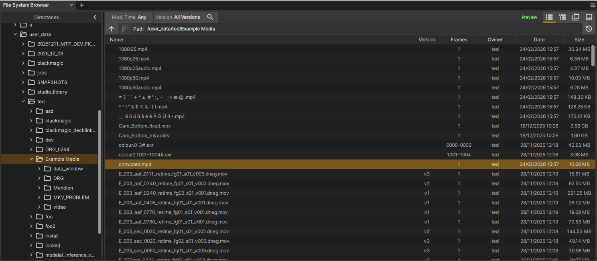
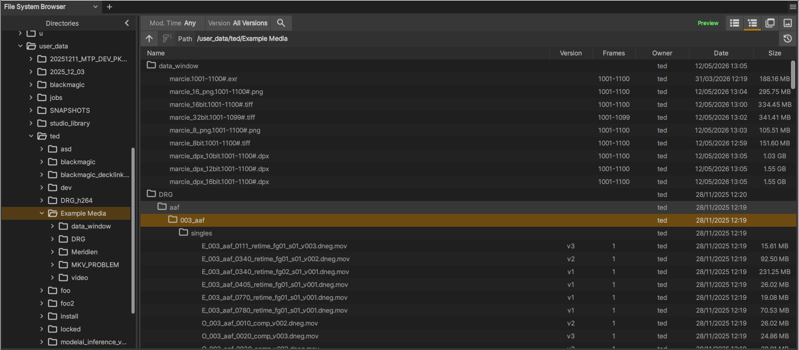
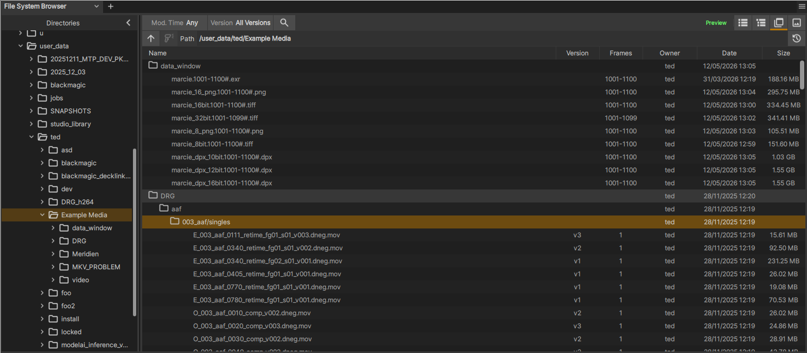
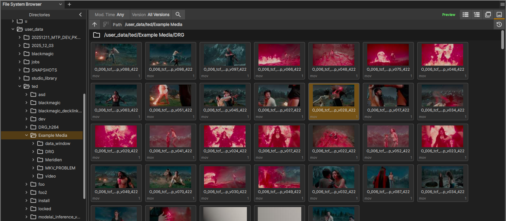

.. _file_system_brwoser:

The File System Browser 
=======================

    The File System Browser.

|

This panel provides an interface for your local and networked filesystems. It proides a directory tree view on the left for navigating the folder structure of your drives and on the right is a results panel that shows media discovered in a directory as well as all media within folders contained therein when you execute a 'full scan' (a recursive folder search)

Key features of this interface are as follows:

    - Fast, multi-threaded scanning of filesystem directories, including recusion through all sub-folders.
    - Instant preview loading of media items for quick viewing
    - Identification of image sequences (where a single media item is many individual files with frame numbering in their file names)
    - A history button showing recent folders visited plus user-pinned folders allowing you to save favourite locations.
    - Auto-completion of directory names as you type into the path bar
    - Thumbanil view, with fast thumnail loading.
    - Multi-select drag/Drop loading of media into Playlists or Media List panels
    - Double-click action to load media into current playlist.
    - 'Reveal in System Browser' to open your regular filesystem browser at the given media item's location.

How to Use the Browser
----------------------

The left section of the browser is a simple tree view of your file system. To start navigating, work in the left directories view as follows

    - Click on a directory button to scan the directory (but not its sub-folders) for media.
    - CLick on the chevron button next to the directory to expand it and see the sub-folders.
    - Click on the 'Full Scan' button next to the directory to do a **deep scan** of the directory and all its sub-folders for media.
    - You can also navigate by typing or copying a path directly into the 'Path' entry box. 
    - The path entry box has autocompletion - as you type, matching sub-folders are listed in a drop-down box
        - Use the Up/Down arrow keys to cycle through the sub-folders
        - To select a sub-folder, hit the Right arrow key and hit Enter
    - Alternatively, when you have selected a folder to complete a deep scan of sub-folders click the deep scan button which is just to the left of the Path input box.
    - When you're inspecting a particular folder and want to go up a level to the parent folder you can hit the Up button (to the left of the Path input box).

When the scanner has found media items they will be displayed in the right-side results panel.

    - Click a media item once to get a preview in the xSTUDIO viewport. This loads the media and allows you to play it. The media is not added to your xSTUDIO session, however.
    - Double click media items to load into the current playlist.
    - Hold CTRL or SHIFT and click on media items to perform multiple-selection
    - Drag-drop your selection from the File System Browser interface into a Playlist/Subset/Contact Sheet/Timeline to add it.
    - Drag-drop your selection into the Media list to add to the current inspected media list (Playlist, Sub-set etc.)
    - In the tree, group and thumbnail views the media items are listed underneath their parent folders - folders can also be drag dropped into Playlists or the Media List to load all of the media items within that folder (including all sub-folders)

.. note::
    When you click on a directory in the directories tree, it's children folders are NOT scanned immediately. Only media found in the folder that you clicked on will show. Click the 'Full Scan' button on the folder to run a deep scan of all sub-folders.
.. note::
    If you don't run a full scan and no media is found, but when there are still sub-folders to look in, the right panel will provide a button to run the full scan.
.. note::
    If you haven't run a full scan and some media WAS found in the folder that you clicked on, the full scan button will not be shown (even if there are sub-folders present that may contain more media). In this case click the 'Deep Scan' button immediately to the left of the path input box.

View Modes
^^^^^^^^^^

The browser has 4 view modes - a flat list, a tree showing full directory hierarchy, a group showing a partially squashed directory view and thumbnail view.

    The list interface.

    The tree interface.

    The grouped interface.

    The thumbnail interface.

File System Browser Walkthrough
^^^^^^^^^^^^^^^^^^^^^^^^^^^^^^^^^^

This short video demonstrates using file system browser, including navigation & loading.

.. raw:: html
    
    
<video src="../../_static/file-browser-01.webm" width="720" height="366" controls></video>

