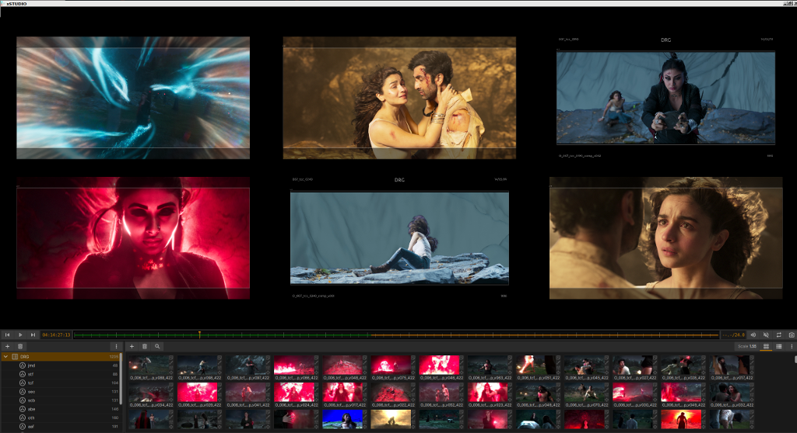

.. _interface

#####################
The xSTUDIO Interface
#####################

xSTUDIO's main window provides 3 different layouts plus some user customization options that can be applied to hide or show UI components. The layouts are intended to support distinct modes of use or workflows. 

The Review layout provides panels showing the session's 'Playlists Panel' and the 'Media List Panel' to the left with the main Viewer on the right. This layout might be used to assemble, adjust, organise and access (for viewing) your playlists and the media that they contain. The Media List interface gives you access to browse your media for viewing and comparing in either an ordered or unordered way. 

The Present layout hides the Playlist and Media List panels to give you the uncluttered and expanded Viewer filling the window for full screen viewing and playback. Hotkey controls can be used to navigate your playlist contents in this mode.

.. note::
    The Edit layout is included only as a teaser at this stage - it includes a dummy image showing the non-linear-editor (NLE) interface which is still under construction.

Tip: Hit the 'Tab' key to toggle between the 'Present' layout and an alternative layout. This defaults to the most recently used layout before Preset.

Customising the Interface
-------------------------

*xSTUDIO in 'Presentation' mode, with customisation of the visible UI components via the hamburger button in the top right corner.*

In this version of xSTUDIO you have some options to customise the interface.

Scaling the panels
++++++++++++++++++

In Review and Edit layouts, you can change the relative size of the panels in the window: Hover your mouse over the 'gutters' that separate the panels. When the mouse pointer changes to a bi-directional arrow you can click and drag the gutter to alter the scale of the panels. 

Hiding/Showing UI elements 
++++++++++++++++++++++++++

Clicking on the 'hamburger' icon to the top right of the window shows the panel for controlling the visibility of some elements of the UI. The list is self explanatory - try clicking on the buttons to learn how to use this to switch between a 'cleaner' or more information rich interface.

.. note::
    Relative panel sizes in the Layouts and UI element visibility will persist between sessions.

.. note::
    Under the 'Panels->Settings' panel you can change the 'UI Accent Colour' that is used for highlighting certain parts of the interface.

Some useful shortcuts are as follows

============  ==============================
Shortcut      Action
============  ============================== 
Ctrl + H      'Hide' UI elements. Use this hotkey to hide the tool bar, the media info bar and the transport controls so the viewport only fills the window.
Ctrl + P      Launch the pop-out (2nd) viewer window.
Ctrl + F      'Fullscreen' This makes the xSTUDIO window go fullscreen (or leave fullscreen).
Tab           This toggles between presentation and your other, most recently used, layout.
Escape        This can be used to leave fullscreen, unhide the UI elements and exit presentation mode.
============  ============================== 

Mouse interaction in the Viewer
-------------------------------

A three buttoned mouse can be used for closer image inspection. Hold the middle button and drag to pan the image within the viewport. Hold down the CTRL key on your keyboard and drag left/right with the middle mouse button to perform a centred zoom in/out on the image. 

In the Settings panel (accessed via the cog icon in the viewer title bar) there is an option to set the behaviour of the mouse wheel - if it is set to 'Zoom Viewer' you can roll the mouse wheel to zoom in/out of the image in the viewer.

.. note::
    To 'reset' the viewer so that the image is auto-fitted (according to your 'Fit' mode set from the toolbar or right-click context menu) use the 'CTRL+R' hotkey sequence.

Transport Controls and Toolbar
-------------------------------

The toolbar and transport controls are found immediately below the Viewer. The toolbar provides controls for modifying the appearance and behaviour of the viewer:

Toolbar
+++++++

The toolbar is a collection of controls that affect on-screen information in the viewport, colour visualisation, playback behaviour and so-on. xSTUDIO plugins are able to add toolbar controls but here we only list the 'native' tooblar controls that are present by default.

.. topic:: HUD

    Click this to toggle the HUD (heads up display) on or off or enter the HUD settings. The HUD is currently a very minimal plugin that provides an overlay showing the data window (for EXRs) and the image boundary.

.. topic:: Mask

    The mask plugin settings are accessed from this button. You can set the mask aspect ratio,safety percent, and mask visualisation (lines, opaque masking etc)

.. topic:: Rate

    Click and drag left/right to adjust to playhead rate multiplier. If 'Rate' is 0.5, your media will play at half speed etc. Double click to toggle between reset value (1.0) and your last setting.

.. topic:: Exposure

    Click and drag left/right to adjust the viewer exposure (in exposure stops). Double click to toggle the value between 0.0 and your last non-zero exposure setting.

.. topic:: Zoom

    Click to activate zoom mode. When zoom mode is on click and drag left/right in the viewer to zoom in/out of the image. Note that the 'Z' hotkey allows you to enter the zoom mode from the keyboard (hold the Z key down while zooming with the mouse).

.. topic:: Pan

    As for zoom, this enters a pan mode where you can click and drag in the view to move the image within the window. The 'P' hotkey can be held down to activate this mode. (Note that you can also pan directly in the viewer using a middle mouse button drag, and zoom by holding CTRL key and middle mouse drag)

.. topic:: 'Fit'
    this setting dictates how the image is auto-fitted into the viewport area. 
        - Width : fits the image exactly into the width of the viewer
        - Height : fits the image height exactly into the height of the viewer
        - Best : auto-chooses width or height fitting so that the whole of the image is always visible in the viewer
        - Fill : auto-chooses width or height fitting so that the viewer is always filled with the image
        - 1:1 : scales and centers the image so that 1 pixel in the image is mapped to 1 pixel of your display device.
    When you pan or zoom the image, the 'Fit' mode will turn to 'Off' to indicate that you have left the auto scale mode and the viewer will maintain your pan/zoom setting. Note that double clicking on the 'Fit' button will the toggle back to your last 'auto fit' Fit Mode or your custom pan/zoom setting.

.. topic:: Channel
    Use for isolated viewing of the R/G/B/A channels or a Luminance display.

.. topic:: Compare
    Sets the way that multi-selected media can be compared. See the 'Playhead Controls' section for more information.

.. topic:: Display
    Set your display's colour profile from this menu. See 'Colour Management' section for more information

.. topic:: View
    Set your OCIO view profile (typically a grade/look + film emulation LUT) from this menu. See 'Colour Management' section for more information

.. topic:: Source
    This allows you to switch the underlying 'source' for the current on-screen media, and will only be useful if you have some studio pipeline integration set-up or are using the  Python API to build media items with multiple encodings.

Timeline
--------

.. image:: ../images/timeline-01.png
   :align: center

Transport Controls
++++++++++++++++++

These are pretty universal and don't need much explanation. There's a play/pause button, step forwards/backwards buttons and fast forard/fast rewind buttons.

Frame Indiator
++++++++++++++

Immediately to the left of the timeline is the 'current frame' indicator. Click on this to get a list of options as to how the current position of the playhead is displayed:
    - *Frames:* absolute frame, i.e. the first frame of the media is always frame 1. 
    - *Time:* the playhead position from the start of the media in seconds
    - *Timecode:* the 8 digit timecode. If the media has timecode metadata this will be used
    - *Frames from Timecode:* This converts the 8 digit timecode into a frame number. Thus it is possible to use the timecode metadata to set the frame number of the first (and subsequent) frames for some piece of media.

Timeline and Playhead UI
++++++++++++++++++++++++

The compact timeline UI in this version of xSTUDIO is a horizontal slider representing the full frame range of the current on-screen source(s). The 'playhead' (indicating the current on-screen frame) is shown as a vertical line. Other information that is visualised is as follows:

    - *Playhead:* This vertical line butted by triangles indicates the current on screen frame. Click and drag left/right to 'scrub' the viewed frame.
    - *In/Out Loops Points:* If you are looping on a sub section of the source frame range, this is indicated by solid grey background in the timline for the areas that are outside the loop range.
    - *Cache Status:* Frames that are 'cached' (i.e. which frames have been decoded off the filesystem and are in memory ready for immediate display) are indicated by a horizontal bar through the middle of the timeline. When you start viewing a new source you should see the cache status refresh as xSTUDIO loads frames ready for playback. For a detailed explanation please refer to the 'Playhead' section.
    - *Note Indicator:* Any notes that are attached to the on-screen source are visualised with a brown horiontal bar (showing the curresponding in/out points of the note) at the bottom of the timeline.

FPS/Duration/Remaining
++++++++++++++++++++++

The box immediately to the right of the timeline shows more information about the media source in the timeline. Clicking in this box shows a pop-up selector you can choose between:
    - The source duration (shown in units set by the frame indicator mode)
    - The amount of time remaining until it has played out (from the current playhead position)
    - The frames-per-second (FPS) indicator showing that actual FPS that xSTUDIO is achieving in playback and the target FPS.

Player/Viewer Controls
++++++++++++++++++++++

Four buttons to the right of the timline provide the following interactions
    - *Volume/mute control:* click once to get a pop-up volume control. Double click to toggle muting of audio.
    - *Loop mode:* set whether the playhead will loop a source in playback, play it once and stop on the final frame or 'ping-pong' loop.
    - *Screenshot:* this button shows an interface for grabbing the current on-screen frame (plus overlays like annotation sketches) and saving to disk as an image file.
    - *Show/Hide Popout Viewer:* xSTUDIO provides a second viewer for dual screen set-ups. Note that the second viewer has all the same features and behavoiur as the main viewer that is embedded in the main UI window.

For a more in-depth description of xSTUDIO's playback behaviours and user interactions please refer to the 'Playback' section of these docs.

The Playlist Panel
------------------

.. image:: ../images/playlist-panel-01.png
   :align: center

The playlists panel provides an interface to access and organise your session through playlists. 

The Session Menu provides top level options for loading, saving and importing (merging) sessions. To add new playlists or dividers hit the Add Playlists button. You can also add playlists through the drag + drop load functionality described in the *Getting Started* section of these pages.

.. note::
    The term 'session' refers to the state of all of your current playlists, media, notes, annotations and so-on, i.e. the entire data content of the application. Any session can be saved to/loaded from a file on disk.

To re-order your playlists, click and drag the 'Drag Handle' to slide a given playlist or playlists up and down the overall collection.

Playlist Flags
++++++++++++++

You can add colour flags to playlists via the 'Playlist Menu' - setting a flag will result in a corresponding coloured bar to show against the playlist item in the Playlists panel. This is an easy way to add your own status indicators or otherwise highlight your playlists as desired.

xSTUDIO Subsets
+++++++++++++++
A 'subset' is a collection of media within a given playlist. This concept provides a convenient way to further categorise media within playlists. Note that any media within a subset is only a reference to the media item in the parent playlist. Thus any media in a subset will always be present in the parent playlist and any changes to a given piece of media (for example added bookmark notes or annotations) will be seen on both the media in the subset and the parent playlist.

The Playlist menu button provides an option to create a new subset on a given playlist. Alternatively, select media in the Media List Panel and use the 'Add to …' right click sub menu to create a new subset from your selection. Add media to a subset by drag-dropping a selection of media from the Media List Panel into the Subset item in the Playlists panel.

Dividers
++++++++

You can add a divider from the 'Add Playlists' button. A divider is simply a labelled bar in the playlist collection that can help with organisation.

The Media List Panel
--------------------

The Media List is a scrollable window showing the ordered list of media in the current selected playlist or subset (note that the selected playlist/subset can be different from the current *viewed* playlist/subset). Each media item is represented by a thumbnail image and the filename of the source media. 

The size of the thumbnails can be adjusted by dragging the handle immediately to the left of the 'File' label at the top of the panel. Thumbnails show the middle frame of a media item but they are also animated - hover the mouse pointer over a thumbnail and move it horizontally left right within the thumbnail width to see other preview frames from the source video.

Media Selection and Viewing
+++++++++++++++++++++++++++

Clicking once on any media item in the media list will select it (if it's not already part of a multi selection). If your viewed playlist/subset (the one showing in the viewport) is the same as your selected playlist/subset (the one showing in the media list panel) then the media you click on will immediately appear in the viewport for playback. If your viewed playlist/subset is different from that selected, but you want to see a media item from the media list, then *double clicking* on it will force the viewed playlist/subset to switch to your selected playlist or subset.

It is also possible to select more than one piece of media and this is required to take advantage of the Playhead compare modes:

    - To set a multi-selection, click on media items while holding the CTRL key or SHIFT keys.
    - The order that you select items is registered and is indicated in the leftmost column of the media view.
    - When you click on a media item that is *already selected* the selection will not change, but the media you clicked on will be played in the viewport (if you're not viewing a different playlist).
    - To clear your selection, click on an unselected media item or use the 'CTRL+D' hotkey.
    - To select all items in the playlist use 'CTRL+A' hotkey.

.. note::
    Multi-selection is required for A/B compare mode. See the Playhead Controls section for more information.

Media List Context Menu (right mouse button)
++++++++++++++++++++++++++++++++++++++++++++

.. image:: ../images/media-list-menu-01.png
   :align: center

A right mouse button click in the Media List will show a pop-up menu giving access to the following features:

    - **Flag Media:** Apply a simple colour coding to the selected media items in the playlist. The 'flag' colour will be shown as a vertical bar to the left of the media - item in the Media List Panel. This could be useful for reminding you to revisit certain media, or to visually categorise them in whatever way you prefer.
    - **Add to New:** Create a new Playlist or Subset from your current selected media.
    - **Copy:** Use options in this sub-menu to copy the full paths or the file names of the selected media to the desktop clipboard. This can be useful to gather a list of media that you want to copy into an email, for example.
    - **Duplicate media:** Copy the selected media items in-place into the same playlist.
    - **Reveal Source File ..:** Open your desktop file browser with the folder of the selected media.
    - **Advanced/Clear Cache:** Unload all decoded video frames from xSTUDIO's cache, freeing up system memory
    - **Clear Selected Media from Cache:** Unloads all decoded video frames from the selected media only. Can be useful if a file has been updated on disk in place and you want to force xSTUDIO to reload it.
    - **Set Selected Media Rate:** Override the playback rate (in FPS) for the selected media.

