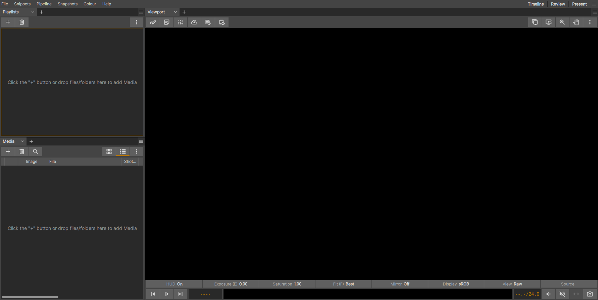
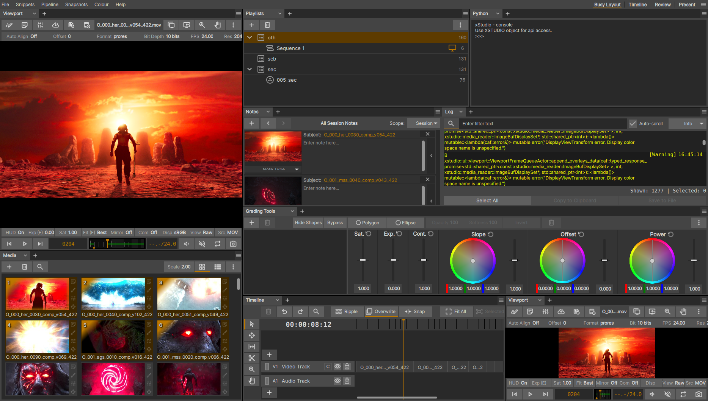
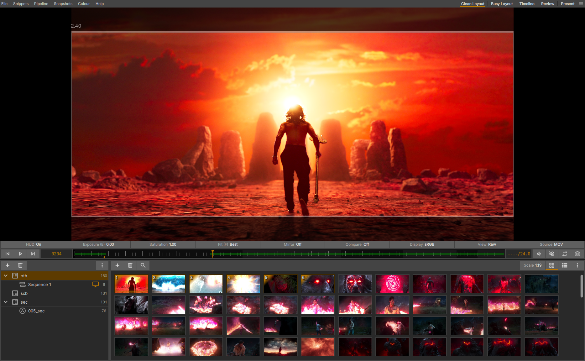
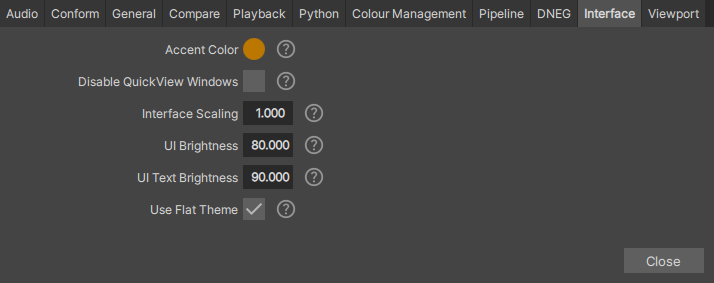
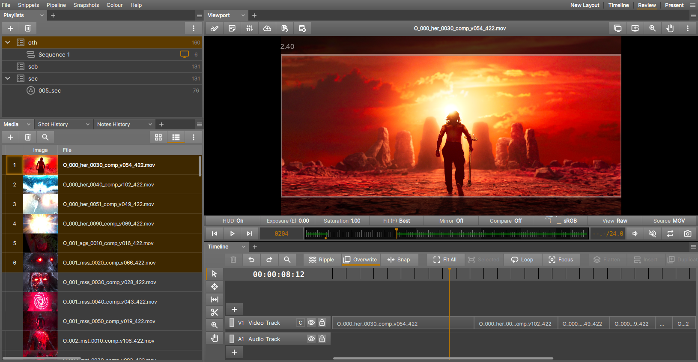
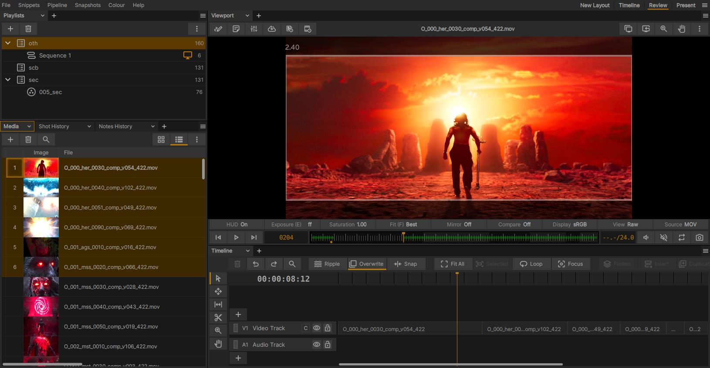

.. _interface_layouts:

Custom Interface Layouts
========================

xSTUDIO's main window provides 3 different default layouts (Timeline, Review, Present) which can be selected from the shelf to the top right of the window. They can also be cycled with the 'F1', 'F2' and 'F3' keys (and so-on if you have more than 3 layouts)

You can modify the existing layouts (except for the Present layout) as much as you like and also create new layouts via the hamburger menu button to the very top-right of the xSTUDIO interface. This menu also gives you options to rename, remove or re-order any of the layouts (except for Present) in the list.

This system is intended to give you total control over how the xSTUDIO GUI is configured so you can make it as simple or as complex as you wish to support your preferred way of working and organising your media and review sessions.

Scaling and dividing the panels in a Layout
-------------------------------------------

Apart from _Present_ each layout splits the xSTUDIO window into horizontal or vertical *panels*. Each panel can contain one or more of xSTUDIO's interfaces - for example, Media List, Playlists, Viewport, Timeline etc. These panels can be resized by clicking and dragging the gutter (the thin space) that separates them. When a panel contains multiple interfaces they will be tabbed so that you can quickly switch which interface is active in the given panel. 

Panels can be sub-divided to create more panels in the interface, and this can done as many times as you like. To sub-divide an existing panel, look for the hamburger menu button that is at the top-right of the panel title bar. This menu has options to split the panel horizontally or verically or to destroy the panel (and thus make space for the remaining panels).

To select the interface that fills a given panel, look for the tab selector that is at the top left of the panel area. There is a chevron button next to the tab title, click on this to get a pop-up option showing you the choices of interfaces that can be loaded into the panel. To use the multiple tabbed panel feature, click on the + button instead to add a new tabbed interface.

    
    A needlessly busy interface, where many panels have been added! Note there are 2 viewports. You are free to have multiple instances of the same interface in different panels if desired.

    A more minimal interface with just a Viewport, Playlist and Media List interfaces. Note that some of the Viewport UI elements have been toggled off to reduce clutter further.

Tip: When you are happy with your layout, it is recommended to make the 'Tab' selectors invisible except for panels which have multiple tabs in them. Doing so reduces clutter in the interface and frees up a bit of real estate. This can be done with the hamburger menu button to the very top-right of the xSTUDIO window. Select 'Hide All' or 'Hide Single Tabs' under the *Tab Vsibility* section of the menu.

Tip: Hit the 'Tab' key to toggle between the 'Present' layout and an alternative layout. This defaults to the most recently used layout before Preset.

.. note::
    To get access to the Panel hamburger menu button in each panel (required for splitting or collapsing panels), you must ensure that the 'Show All' option is selected in the *Tab Visibility* section of the main Layouts menu (accessed from the hamburger menu button at the very top-right of the xSTUDIO window)

.. note::
    All aspects of your Layout and UI customisations are automatically saved so that they persist between future xSTUDIO session.

Customising the Interface Walkthrough
-------------------------------------

This short video demonstrates some of these customisations in action:

.. raw:: html
    
    
<video src="../../_static/ui-customise.webm" width="720" height="366" controls></video>

|

Other Customisaions
-------------------

Via the *File->Preferences->Preferences Manager* you can launch the tool to set user-preferences. Go to the Interface tab to get some options for changing the appearance of the xSTUDIO interface. 

    Control the UI brightness, scaling and gradient look through these user preference settings.

You can modify the overall tone of the interface, both the font/icon brightness and the background level. With the *flat* theme off, widgets are drawn with a subtle gradient effect for a more modern look, though some users might find that the gradients in the UI can subconciously affect perceptual assessment of image content in the viewport. A UI scaling option is 

    The UI with higher brightness and flat theme disabled.

    The UI with flat theme and darker settings. The best setting for you will most likely depend on your monitor/display properties and the ambient lighting in your working area.

