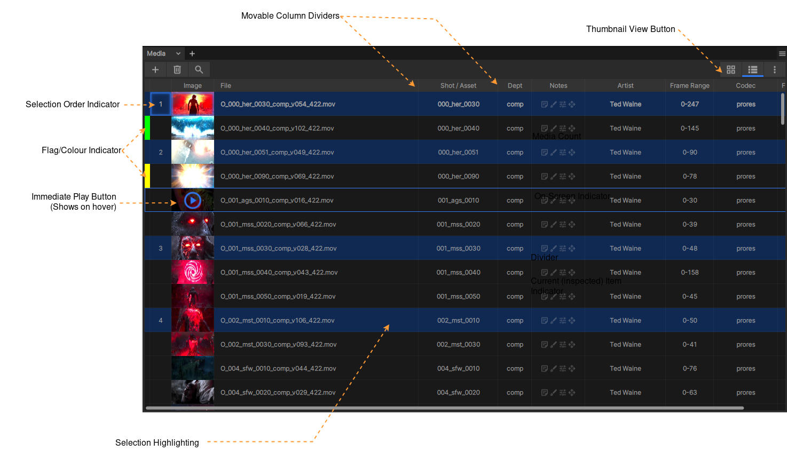
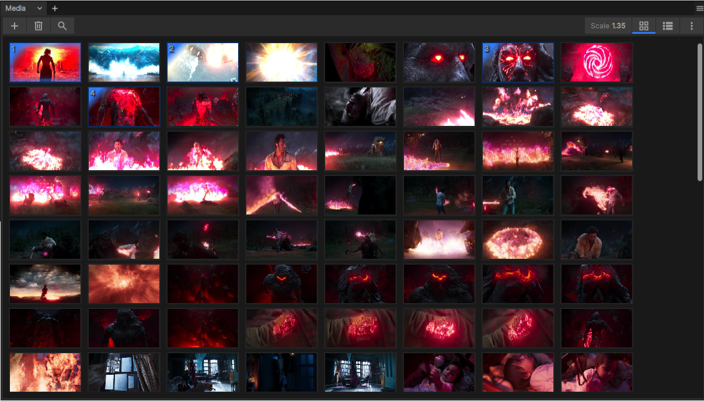
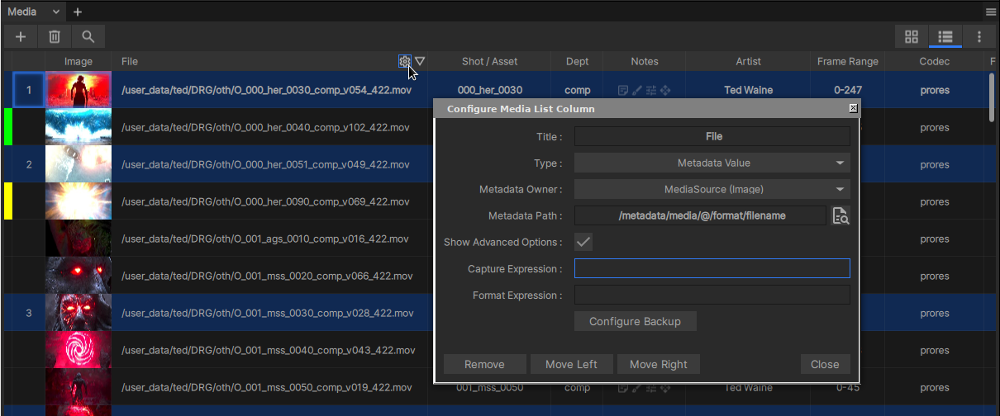

.. _media_list_panel:

The Media List Panel
====================

    The Media List in 'List' mode.

|

The Media List is a scrollable window showing the ordered list of media in the current *inspected* Playlist, Subset, Contact Sheet or Sequence. For more detail on the difference between the *inspected* and *viewed* playlist item see :ref:`Inspecting playlist media <inspecting_playlist_media>`. 

The media list provides two view options toggleable via the buttons to the top right of the panel: list mode (above figure) or thumbnail mode (below).

    The Media List in 'Thumbnail' mode.

Media Selection and Viewing
---------------------------

Clicking once on any media item in the media list will select it (if it's not already part of a multi selection). For Playlists or Subsets the media selection will drive which media is played in the xSTUDIO Viewport. For Compare Modes and Sequences, however, the selection does not affect the media being played. If your *viewed* Playlist/Subset/Contact Sheet/Sequence is different from that selected, but you want to see a media item from the media list, then *double clicking* on it will force the viewed playlist/subset to switch to your selected playlist or subset.

It is also possible to select more than one piece of media and this is required to take advantage of the Playhead compare modes:

    - To set a multi-selection, click on media items while holding the CTRL key or SHIFT keys.
    - The order that you select items is registered and is indicated in the leftmost column of the media view.
    - When you click on a media item that is *already selected* the selection will not change, but the media you clicked on will be played in the viewport (if you're not viewing a different playlist).
    - To clear your selection, click on an unselected media item or use the 'CTRL+D' hotkey.
    - To select all items in the playlist use 'CTRL+A' hotkey.

.. note::
    Multi-selection is required to use xSTUDIO :ref:`Compare Modes <compare_modes>` 

Media List Context Menu
-----------------------

.. figure:: ../images/media-list-menu-01.png
    :align: center
    :alt: The Media List context menu.

    The Media List context menu. Accessed with right mouse button or 'More' button to the top right of the Media List panel.

A right mouse button click in the Media List will show a pop-up menu giving access to various actions relating to the selected media. From this menu you can move/copy media selections into new Playlists/SubSets/Contact Sheets/Sequences:

    * Set Media 'flag' Colour to highligh media with some status according to your own scheme.
    * Select media (select all, select only offline media)
    * Copy/Move media to new Playlists/Subsets etc.
    * Duplicate selected media items
    * Show media location on disk in the system file browser.
    * Copy file names or file paths of selected media to the clipboard.
    * Open a :ref:`QuickView <quick_view>` window to play selected media.
    * Reload media (discard cached frames, rescan frame range and re-load). 
        This option is useful if you have loaded a CG render or comp, say, that is still in progress. As more frames appear on disk you can hit the Reload menu option or the associated hotkey and the media item will refresh with the new incoming frames loaded.
    * Run :ref:`Python Snippets <python_snippets>` (your own custom Python scripts)

Configuring Media List Columns
------------------------------

The list mode of the Media List displays metadata in columns that are fully configurable. You can add, remove and rearrange these columns and choose what metadata they show. You can also set-up regular expressions that capture a section of the metadata string for display.

    The Media List configuration dialog.

To configure the media list columns:

    1. Hover the mouse over one of the column headers. A cog icon will appear in the column header. Click on this to open the configuration dialog.
    2. Use the Remove/Move Left/Move Right buttons to delete or shift the column.
    3. Set the title for the column
    4. Select the type of indicator for the column from the drop-down. There are 'standard' types with a fixed purpose or choose **Metadata Value**
    5. If you select **Metadata Value**, now choose where the metadata will come from with the **Metadata Owner** dropdown.
        * **Media** - The Media item is a container for Media Sources, and will *only have metadata if you have some automated scripts set-up that add metadata. This will usually only be the case for users working at a post production studio with some pipeline integration systems set-up.* See :ref:`Pipeline Integration <pipeline_integration>` for more details. For individual users working outside of a studio the *Media* option here will be empty and not useful.
        * **Media Source (Image)** - Selecting this will mean you can lookup metadata values to do with the *image* source of the media item.
        * **Media Source (Audio)** - Selecting this will mean you can lookup metadata values to do with the *audio* source of the media item.
    6. Now we need to set the **Metadata Path** in order to pick a field from the metadata dictionary.
        * Media Sourced metadata is essentially a dictionary of metadata that was extracted from the media file. For example, EXR images can have a lot of data stored in the image header - xSTUDIO will read this data and store it as metadata of the Media Source.
        * The easiest way to select metadata fields is by clicking on the document magnifier button to the right of the corresponding box.
        * A new window will open listing all of the metadata fields for the Media Source.
        * Click on any of the lines in the list of metadata fields to choose it for you Media List column.
    7. (*Advanced*) Use a regular expression to match to the metadata field value and extract usedful sections of a longer string such as a full file path
        * Regular expressions are powerful but fiddly to use! Do some internet research to learn more about them if you are not familiar.
        * For example, you might choose the file path metadata value. The file path could be **/Users/joe/media/ARX/001_prd_0200/renders/comp/C_001_prd_0200_comp_v001.mp4**
        * Visually, showing the whole file path is not useful. We might prefer just **C_001_prd_0200_comp_v001**
        * To do this, we can set the regular expression to this: **.+\/([_a-zA-Z0-9]+_v[0-9]+)\.mp4**
        * And we set the format expression to **$1** to show the 1st captured string.

Configuring Media List Walkthrough
^^^^^^^^^^^^^^^^^^^^^^^^^^^^^^^^^^

This short video demonstrates using regular expressions and metadata fields to clarify and add information to the media list.

.. raw:: html
    
    
<video src="../../_static/media-list-config-01.webm" width="720" height="366" controls></video>

