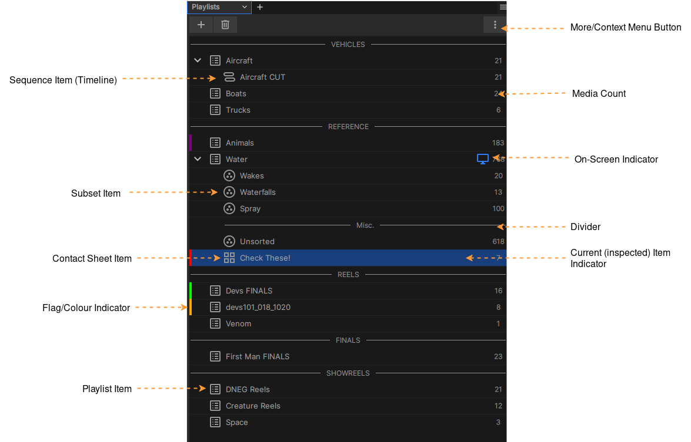

.. _playlist_panel:

The Playlist Panel
==================

    The Playlists panel
    

The Playlists panel provides an interface to access and organise your Session through Playlists. The playlist heirarchy is designed to allow you to easily organise from small to very large collections of media and also to collect sub-groups of the media items and timeline edits within playlists. 

.. note::
    xSTUDIO timeline edits (sequences) are always a child of a Playlist. The Playlist is a superset of the media within the Sequence and will always include all the media referenced by the Sequence as well as media that may not be in the Sequence.

.. note::
    The term 'Session' refers to the state of all of your current playlists, media, notes, annotations and so-on, i.e. the entire data content of the application. Any session can be saved to/loaded from a file on disk.

Getting Started
---------------

There are multiple ways to start building playlists:

    * **Use the More/Conext Menu Button (or right-mouse-button click in the panel) to access the Playlists menu.**
    * Drag-drop folders from the filesystem will create Playlists named according to the folder name.
    * Drag-drop individual media files into the playlist panel will create a playlsit with a default name.
    * Use the + button to access the Playlist creation menu.
    * From the :ref:`Media List Panel <media_list_panel>` you can copy of move media into a new Playlist via the context menu.

.. _inspecting_playlist_media:

Inspecting Playlist Media
-------------------------

To see the media within a Playlist simple single-click on the Playlist item. It will be set to the *inspected* item meaning the :ref:`Media List Panel <media_list_panel>` will now show the content of the Playlist. Note that the inspected Plalist item is indicated by a highlight colour.

Viewing Playlist Media
----------------------

To actually start viewing media in a Playlist (or Subset, Contact Sheet, Sequence), it must be set to be the 'on-screen' item. This is simply done by double clicking on the item in the Playlists panel. The on-screen item is indicated by a screen icon showing to the right side of the item in the panel (see the diagram above). Note that the on-screen item can differ from the *inspected* item, which is the item whose content is shows in the Media List Panel - this is to allow us to copy/move media between playlists without disturbing what's being played in the Viewport.

Organising Playlists
--------------------

    * Playlist items can be re-ordered with a simple drag/drop action.
    * Dividers can be created to help with organisation - use the context menu or plus button to create Dividers.
    * The context menu provides options for renaming Playlists, Dividers and so-on
    * Use the trash-can icon or context menu to remove Playlists, Dividers and so-on
    * To move/copy media *between* Playlists/Subsets etc. select the media items via the :ref:`Media List Panel <media_list_panel>` and drag/drop from there into an item in the Playlists panel.

Playlist Flags
--------------

You can add colour flags to Playlists, Subsets, Contact Sheets etc. via the Set Colour sub-menu in the Context Menu. The flag acts as a simple indicator and is entirely for the user's own purposes for colour coding items in the session for their attention.

xSTUDIO Subsets
---------------

A *Subset* is a collection of media within a given Playlist. This concept provides a convenient way to further categorise media within Playlists. Note that any media within a Subset is only a reference to the media item in the parent Playlist. Thus any media in a Subset will always be present in the parent Playlist and any changes to a given piece of media (for example added bookmark notes or annotations) will be seen on both the media in the subset and the parent Playlist.

Creating and building Subsets

    * From the '+' menu select 'Subset' to add a new Subset to the current selected Playlist. If no Playlsit is selected a default parent is also created for the Subset.
    * From the More/Context Menu choose the *Add New->Subset* option.
    * In the :ref:`Media List Panel <media_list_panel>` select media items in an existing Playlist and use *Add Media To...->New Subset* menu option
    * With a 

If media that is referenced by a Subset is deleted from the parent Playlist, then the media will also be deleted from the Subset. However, the reverse **is not true** and deleting media from a Subset will not remove it from the Playlist.

xSTUDIO Contact Sheets
----------------------

A *Contact Sheet* is quite similar to a subset except that all the media within the Contact Sheet is active in the Viewport compare mode, regardelss of the selection state of the media. Thus, if the compare mode on the Contact Sheet is set to 'Grid' then all the media in the Contact Sheet will be displayed in the Viewport using the Grid layout. For more details read the :ref:`Compare Modes <compare_modes>` section.

Dividers
--------

You can add a divider from the 'Add Playlists' button. A divider is simply a labelled bar in the playlist collection that can help with organisation.
