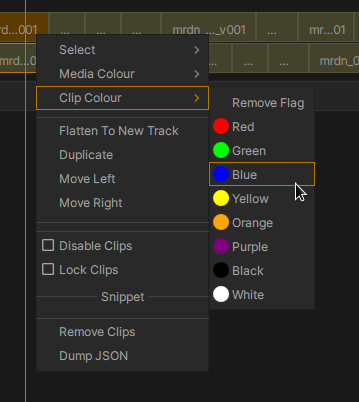

.. _timeline:

The Timeline
============

.. figure:: ../images/timeline-01.png
    :alt: The xSTUDIO Timeline Interface
    :figclass: align-center
    :align: center
    :scale: 60 %

    The Timeline Interface

xSTUDIO's Timeline/Sequence interface allows you to load, create, export and interact with mult-track video edits. It has some features that are specifically tailored for VFX and Animation *review* workflows, as well as general purpose editing tools.

Sequence Creation
-----------------

To get started you must first have a Playlist. Select the Playlist and then use the *Add New->Sequence* from the right-click Context/More menu in the :ref:`Playlists Panel <playlist_panel>`. You can then select a Playlist that contains media so that the media shows in the :ref:`Media List Panel <media_list_panel>`, select media from the Media List and drag-drop into the Sequence object in the Playlist Panel. Alternatively you can select media from a playlist and in the Media List choose *Add Media To->New Sequence ...* menu option.

There is a quickstart video demo :ref:`here. <creating_a_sequence>`

.. note::
    When a Sequence is created you must set its Frame Rate. The Sequence frame rate is important because if you load media into a Sequence, where the media frame rate is not the same as the Sequence frame rate, then xSTUDIO will perform a simple 'pull-down' to allow the media to play within the Sequence. However, the pull-down can introduce a number of problems like the clip not matching the duration of the underlying media or video frames being dropped during playback. It is therefore recommended to match the Sequence frame rate to the source media, and not use media with mixed frame rates in one Sequence - for such a workflow you will need more sophisticated re-timing tools that you would find in dedicated, professional editing systems. 
    
    A drop-down in the New Sequence dialog is provided to set the Frame Rate and there is a default frame rate xSTUDIO preference too.

Loading and Exporting Timelines
-------------------------------

xSTUDIO uses the excellent `OpenTimelineIO <https://opentimelineio.readthedocs.io/en/stable/>`_ Python modules to allow it to load and export timelines in a variety of formats for compatibility with professional editing software like Premiere and Avid. To load a timeline, use the *File->Import->OTIO...* menu option from the main menu bar at the top of the xSTUDIO interface. Similarly to export a timeline file from an xSTUDIO sequence, select the sequence in the :ref:`Playlists Panel <playlist_panel>` and use *File->Export->Selected Sequence as OTIO...* menu option.

.. note::
    xSTUDIO's internal data model for representing Sequences is closely based on the OTIO model.

Interacting with Sequences
--------------------------

The basic editing tools in the timeline should be quite easy to find your way around. The timeline zoom and pan settings are important for navigation of an edit, especially longer edits. The default hotkey shortcut *F* will re-*focus* the timeline view on all of the clips - i.e. the zoom will be adjusted so that the entire duration of the Sequence will fit into the timeline window. You can also use the *Fit All* button for this purpose.

Basic Editing Features
^^^^^^^^^^^^^^^^^^^^^^

To make and build video tracks:

* Create new video or audio tracks with the **+** buttons
* Drag-drop media into the Sequence from the MediaList into tracks to start adding media to the edit.

Activate tools via the buttons in the left-hand toolbox to move, trim and cut clips and navigate the Sequence:

* Use the *Select* tool to click-select or drag-select clips in the timeline.
* Use the buttons in the left-hand toolbox to access the *Move* tool to start dragging clips around the timeline. 
* In *Move* mode, when the mouse hovers on the edge of a clip a handle will appear that can be used to trim or extend the clip at either end (but within the available duration of the underlying media). 
* The *Roll* tool allows you to click and drag the mouse within a clip - this will slide the active range of the clip within the available range of the media. This is only useful if you have trimmed the clip and it has handles
* The *Cut* tool will split the clip under the mouse into two clips when you click the left mouse button.
* The *Zoom* tool allows you to change the visual scaling of the Timeline by clicking and dragging in the timeline. Note that holding the CTRL key and scrolling the middle mouse wheel (if you have one) will also adjust zoom.
* The *Pan* tool allows you to slide the visible window into the timeline with a mouse drag left/right

Focus Mode
^^^^^^^^^^

Activate the *Focus* mode by clicking the corresponding button (near the middle-top of the interface). This mode can be really useful in the context of VFX and Animation reviews. What it does is ensure that the *selected clips or tracks will always be visible, even if they aren't topmost in the stack*. This means that you can have a stack of video tracks with various versions / outputs conformed into the timeline. If you want to see the whole edit, but with for one shot you want to see an earlier version that is buried in one of the lower video tracks, you can select that particular clip and use *focus* mode. The selected clip will then be visible during playback, overriding other clips that would otherwise hide it. A similar logic can be applied to whole video tracks.

Looping on a Section
^^^^^^^^^^^^^^^^^^^^

Activate the *Loop* modew by clicking the corresponding button (next to the *Fcous mode* button). The playhead will only loop over the range of the selected items in the Sequence during playback.

Ripple Mode
^^^^^^^^^^^

Activate the *Ripple* mode by clicking on the corresponding button. Now, when using the *Move* tool to slide a clip, all clips in the same video track that *follow* that clip will be slid by the same amount.

Overwrite Mode
^^^^^^^^^^^^^^

Activate the *Overwrite* mode by clicking on the corresponding button. Now, when using the *Move* tool to slide a clip you can slide a clip over the top of other clips - when you release the mouse button the clip will be dropped into that location and the clips underneath will be spliced accordingly to accommodate the moved clip's new timing within the video track.

Context Menu
^^^^^^^^^^^^

When one or more clips are selected, a right-mouse-button click will show the 'Clip' context menu, providing a numbewr of actions to move, disable, enbale, delete clips, set a custom highlight colour on selected clips and so-on.

Sequence Markers
----------------

Simple markers can be added to a Sequence via the right-mouse Context menu *somehere in the blank space of the timeline* and then chosing Add Marker. The new marker will be created at the current playhead position. By right-mouse-button clicking when the pointer is hovered over a marker you will get a menu allowing you to set a colour, a name for the marker and a comment string which will be visible if the marker is subsequently clicked. 

.. figure:: ../images/timeline-markers-01.png
    :align: center
    :alt: Sequence Markers
    :scale: 100%
