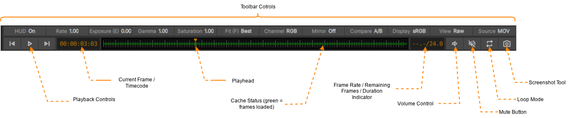
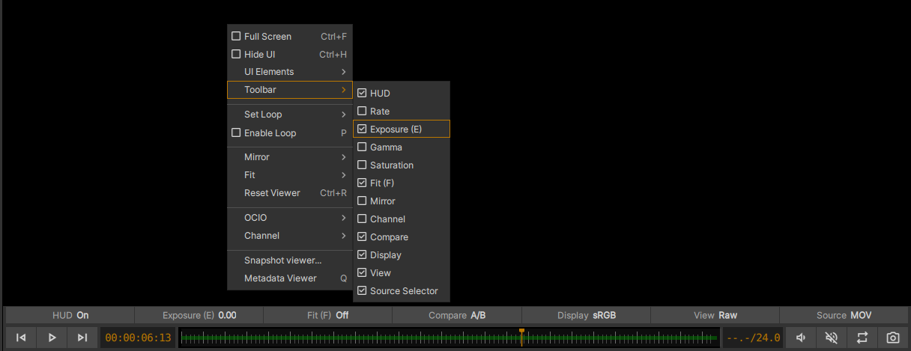

.. _transport:

Transport Controls and Toolbar
==============================

    The Toolbar and Transport Controls. Note that all toolbar buttons have been activated via the Viewport context menu (right-mouse click in Viewport)

The toolbar and transport controls are found immediately below the Viewer. The toolbar provides controls for modifying the appearance and behaviour of the viewer:

Transport Controls
------------------

The xSTUDIO transport controls allow you to start/stop playback and jump through media items in a sequence. The buttons should be largely familiar to users, with the following notes:

    * Click on the timecode/current frame indicator for options to change the display.
    * The 'Frames from trimecode' will display the timecode as an absolute TC frame. Thus a timecode of 00:00:10:10 for a 24fps media item has a TV frame of 254, for example.
    * Click and scrub in the timeline bar to set the current frame.
    * The snapshot tool provides a way to export the current frame as a still image (including on-screen annotations).
    * In the timebar area, green blocks indicate frames that have been decoded and stored in the cache ready for playback. To adjust the size of the image cache see :ref:`xSTUDIO preferences <xstudio_preferences>`
    * When frames are not available (for example when A/B comparing two media items with different durations, and you are viewing the item with the shorter duration) orange bars are shown in the timeline.

xSTUDIO Toolbar
---------------

xSTUDIO's toolbar provides a number of buttons that allow interaction with various settings to do with the playback and display of media. Note that each button in the toolbar can be hidden or shown as a user-configurable setting to allow you to only include the buttons that are useful, as required. The toolbar can also be completely hidden if desired. Note that some state that is controlled by toolbar buttons can also be adjusted via xSTUDIO hotkeys. The elements of the toolbar are summarised as follows:

.. topic:: HUD

    See :ref:`xSTUDIO HUD <xstudio_hud>` page for more. Click this to toggle the HUD (heads up display) on or off. The HUD is composed of multiple elements, which can be toggled active/inactive independently.

.. topic:: Rate

    Click and hold the mouse button down and drag (scrub) left/right to change the playback 'rate'. Double click to reset. This is a multiplier applied to the playhead speed, allowing you to slow down or speed up playback with fine control

.. topic:: Exposure

    Click and drag left/right to adjust to the viewer exposure. Double click to reset. You can also adjust exposure by holding the 'E' hotkey and dragging the mouse left/right in the viewport itself.

.. topic:: Gamma

    Similar to exposure, but controlling viewer gamma. Default hotkey to scrub gamma in the viewport is 'Y'.

.. topic:: Fit

    Set the Viewport 'fit' mode. Controls auto-scaling of the image to fit to the geometry of the Viewport. 
        - Width : fits the image exactly into the width of the viewer
        - Height : fits the image height exactly into the height of the viewer
        - Best : auto-chooses width or height fitting so that the whole of the image is always visible in the viewer
        - Fill : auto-chooses width or height fitting so that the viewer is always filled with the image
        - 1:1 : scales and centers the image so that 1 pixel in the image is mapped to 1 pixel of your display device.
    When you pan or zoom the image, the 'Fit' mode will turn to 'Off' to indicate that you have left the auto scale mode and the viewer will maintain your pan/zoom setting. Note that double clicking on the 'Fit' button will the toggle back to your last 'auto fit' Fit Mode or your custom pan/zoom setting.

.. topic:: Channel

    Allows the Viewport to select a single colour channel (R,G,B or Luminance) for display in the Viewport. Default hotkeys are R,G,B and CTRL+L (for luminance).

.. topic:: Mirror

    Transform the entire Viewport by flipping or flopping (or both) the entire image. (default hotkey to cycle the mirror modes: SHIFT + F)

.. topic:: Compare

    Sets the way that multi-selected media can be compared. See the 'Playhead Controls' section for more information.

.. topic:: Display

    this setting dictates how the image is auto-fitted into the viewport area. 
        - Width : fits the image exactly into the width of the viewer
        - Height : fits the image height exactly into the height of the viewer
        - Best : auto-chooses width or height fitting so that the whole of the image is always visible in the viewer
        - Fill : auto-chooses width or height fitting so that the viewer is always filled with the image
        - 1:1 : scales and centers the image so that 1 pixel in the image is mapped to 1 pixel of your display device.
    When you pan or zoom the image, the 'Fit' mode will turn to 'Off' to indicate that you have left the auto scale mode and the viewer will maintain your pan/zoom setting. Note that double clicking on the 'Fit' button will the toggle back to your last 'auto fit' Fit Mode or your custom pan/zoom setting.

.. topic:: Channel

    Use for isolated viewing of the R/G/B/A channels or a Luminance display.

.. topic:: Compare

    Sets the way that multi-selected media can be compared. See :ref:`Compare Modes <compare_modes>` section of these pages.

.. topic:: Display

    Select the colour space of your physical display device. With active colour management this will allow you to compensate for the properties of your monitor/projector to ensure that the images that you are viewing are accurately presented.

.. topic:: View

    Set your OCIO view profile (typically a grade/look + film emulation LUT) from this menu. See See :ref:`Colour Management <colour_management>` section for more information

.. topic:: Source

    For Media items with multple on-disk sources, this button allows you to select the active source for both image and audio.
    
    For images with multiple *streams*, *parts* or *layers* (such as EXR and some containerised image formats like .mov) you can select which stream or part is active from the pop-up menu here. You can also open a floating window that allows you to select the stream/part/layer from the pop-up too if desired.

    For more information on Media items and Media Sources read :ref:`xSTUDIO Media Items <media_items>` 

Configuring the xSTUDIO Toolbar
^^^^^^^^^^^^^^^^^^^^^^^^^^^^^^^

Via the Viewport More/Context menu (right click in the viewport or hit the More button at the top-right of the Viewport panel) you can enter the *Toolbar* sub-menu to activate or de-activate toolbar items to de-clutter or power-up your own toolbar.

    The buttons in the toolbar can be toggled to hidden state to optimise your interface.

