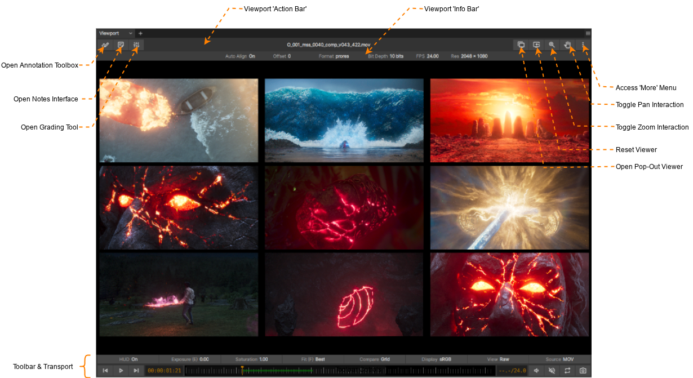

.. _viewport:

The Viewport
============

    The Viewport (demostrating 'Grid' compare mode on 9 Media Items)

The Viewport is the panel where images are displayed and is naturally where your attention is most of the time! There is some level of customisation that is possible and this can be done via the Context/More menu (either right mouse button click in the Viewport or click on the 'More' button at the very top right of the viewport).

.. note::
    All of the buttons in the Viewport action bar have associated hotkey shortcuts meaning that the action bar can be hidden without losing access to the associated functionailty - if one can familiarise oneself with those shortcuts!

   .. list-table:: Viewport Action Bar Shortcuts
      :widths: 10 40
      :width: 50 %
      :align: center
      :header-rows: 1
      :stub-columns: 1

      * - Action Button
        - Default Keyboard Shortcut
      * - Show annotations toolbox
        - D
      * - Show notes panel
        - N
      * - Show grading panel
        - SHIFT+G
      * - Show pop-out Viewport
        - CRTL+P
      * - Activate Viewport Zoom
        - Z
      * - Activate Viewpoert Pan
        - X

Interacting with the Viewport
-----------------------------

A three buttoned mouse can be used for closer image inspection. Hold the middle button and drag to pan the image within the viewport. Hold down the CTRL key on your keyboard and drag left/right with the middle mouse button to perform a centred zoom in/out on the image. 

From the Viewport action bar, buttons are provided to toggle on/off zoom and pan modes where the left/primary mouse button drag can be used to zoom in/out or pan the image within the viewport. After zooming/panning the image the Fit hotkey (default key: F) will restore the fit mode.

In the xSTUDIO preferences there is an option to set the behaviour of the mouse wheel - if it is set to 'Zoom Viewer' you can roll the mouse wheel to zoom in/out of the image in the viewer. Alternatively you can use the middle mouse scroll wheel to shuffle forwards/backwards through the frames.

Clicking and dragging left/right with the main/left mouse button will scrub the playhead forwards/backwards through frames. The mouse sensitivity for this action can also be set via user preferences.

.. note::
    To 'reset' the viewer so that the image is auto-fitted, the exposure is normalised, the channel setting is returned to RGB, the playback rate is set to 1.0 hit the Reset button in the viewport action bar or use the 'CTRL+R' hotkey sequence.

