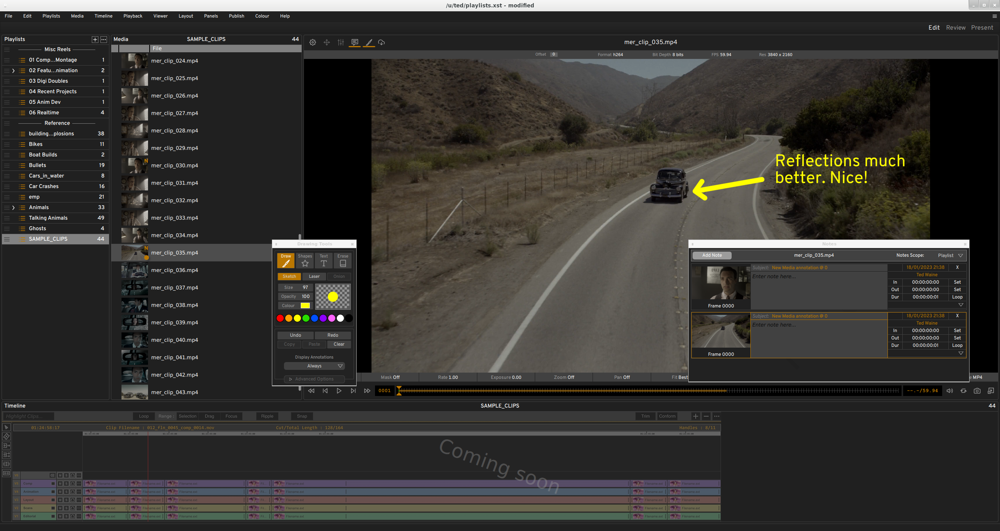

============
Introduction
============

.. figure:: images/interface-04.png
    :alt:  xSTUDIO Dual Window Interface
    :figclass: align-center
    :align: center
    :scale: 60 %

    xSTUDIO Dual Window Interface

What is xSTUDIO? 
****************

xSTUDIO is a media playback and review application designed for professionals working in the film and TV post production industries, particularly the Visual Effects and Feature Animation sectors. xSTUDIO is focused on providing an intuitive, easy to use interface with a high performance playback engine at its core and C++ and Python APIs for pipeline integration and customisation for total flexibility. The application is compatible with MacOS (Apple), Microsoft Windows and many popular Linux desktop distributions.

xSTUDIO is optimised to import and handle very large collections of media sources rapidly, loads specialised image formats and displays images with accurate colour management. Users can quickly import, organise and group media into playlists and 'subsets', playing through and looping on media items and adding review notes and sketched annotations, allowing one to view the media in a highly interactive and collaborative way. A non-linear editing (NLE) timeline interface allows users to create, import and export multi-track video and audio edits quickly and easily. This enables workflows that are essential for teams in VFX, animation and other post-production activities who need to see, on demand, the artwork that they and their colleagues are creating both as discreet media items and in the context of a sequence edit. For example one can jump between the viewed media source instantaneously, inspect pixels close-up, do frame-by-frame comparisons across multiple media sources, annotate the media with drawings and captions or add feedback notes to share.

xSTUDIO v1.X - Overview
***********************

xSTUDIO is a robust and high performance playback and review solution. It has been deployed at DNEG since September 2022 and is in daily use by thousands of VFX and Animation artists, supervisors and producers across our global teams to conduct daylies and image review. The application has been developed and extended thanks to the input and feedback from DNEG's large and diverse crew and as such xSTUDIO is very much a product made for and made by VFX and animation professionals.

Here are some highlights of xSTUDIO's capaility and performance.

**The Interface**

  - The application interface is highly flexible and configurable.
  - Set-up its appearance and components to suit you own visual preferences and workflows.
  - *Layouts* allow multiple interface configurations to be created and seamlessly switched as you work.
  - Many components of the UI can be toggled on or off:
    - Create a 'clean' and minimial look to the application ...
    - ... or an interface bursting with features and information ...
    - ... or anything in between.

**Loading Media**

  - Display virtually any image format in common use today (EXR, TIF, JPG, MOV, MP4 etc).
  - Drag and drop media from the desktop file system browser directly into the xSTUDIO interface.
  - Use the command line interface to 'push' media into a running xSTUDIO instance from a terminal window.
  - Use the Python API to build playlists with your own custom scripts.

**Playlists**

  - Create any number of playlists, colour code and arrange them under category headers.
  - Drag and drop to reorder and organise media and playlists.
  - Colour code individual media and playlists with the 'flags' feature.
  - Nest mini-playlist *subsets* under parent playlists to further structure your viewables.
  - Create *contact sheets* under parent playlists, to lay-out multiple media items in a grid arrangement for comparison.

**Sequences**

  - Create multi-track video timelines by drag/dropping media from playlists into the timeline interface.
  - Edit your timelines with the simple, easy to use editing tools.
  - Import and export timelines using the OpenTimelineIO interchange facility.
  - Use review friendly timeline tools like the 'focus' mode and item looping to make sequence based reviews fast and easy.

**Notes**

  - Add notes and annotations to media on individual frames or range of frames.
  - On screen annotations can be created with easy to use, highly responsive sketching tools. Annotations features currently include:
    1. Adjustable colour, opacity and size of brush strokes. 
    2. Shapes tool for boxes, circles, lines and arrows etc. 
    3. Eraser pen for even more sketching flexibility .
    4. Editable text captions with adjustable position, scale, colour and opacity.
    5. 'Snapshot' button allows you to save an annotation to disk as a jpeg /tiff etc image. 
  - Navigate your media collection through the notes interface by jumping directly to bookmarked frames.

    xSTUDIO's Contact Sheet viewer mode

**The Viewer**

  - Colour accurate display (OCIO v2 colour management).
  - Hotkey driven interaction.
  - Adjust exposure and playback rate.
  - Zoom/pan image tools, RGBA channel display.
  - Multiple 'Compare Modes' allowing comparison of image stacks:
    - Grid Mode for tiled layout of multiple sources
    - A/B & Wipe Compare
    - Compositing modes (Over, Screen, Add etc.)
    - String Out mode: dynamically string together many sources in a flat edit list
  - Adjustable masking overlay and guide-lines.
  - 'Pop-out' 2nd viewer for dual display set-ups.
  - Audio playback for sources containing embedded audio streams.

**Other Capabilities**
  - Apply creative grades to shots & renders with the grading tool.
    - Grades can be masked with editable polygon shapes
    - Grade masks can be softened
    - Export a grade to Nuke with a simple copy/paste operation
  - QuickView for instant inspection of individual media items
    - While xSTUDIO is running, a command line call can pop-out an independent light player window for viewing a single piece of media in isolation.

**API features for pipeline developers**

*C++ API*

  - Write plugins with full access to the application's internal components down to the lowest level if desired.
  - C++ base classes are provided for implementation of common plugin typs:
    - Video Output Plugin - for delivering video external to the application, like SDI video cards, rendering to disk or streaming video content
    - Viewport Overlay Plugin - for drawing custom graphics, text and data directly into the viewport
    - Colour Pipeline Plugin - for implementing colour management.
    - Media Reader Plugin - implement readers for specific file formats
    - Data Source Plugin - build plugins to interact with production databases and source media to import into xSTUDIO
    - Metadata Hook Plugin - add pipeline metadata to media on creation
  - Code for DNEG's powerful Shotgrid browser interface, exploiting the Shotgrid REST API, is also included for reference. It is written for DNEG's proprietary Shotgrid table schemas and won't work 'out of the box' but developers could adapt the code to work at other studios if desired.

*Python API*

  - Create python Plugins that can:
    - deliver menus and any other GUI elements you wish 
    - interact with the xSTUDIO session by adding and re-organising media
    - add on-screen overlay graphics
    - receive event notification during playback
  - Connect to an xSTUDIO instance transparently from a separate process via the Python API - thus xSTUDIO can be run in a separate software environment to an application, controlling it through the API.
  - An embedded python interpreter is also available to execute scripts within xSTUDIO. This runs in a separate thread to the UI so python execution will not affect GUI interactivity or playback.
  - Create and build media playlists through straightforward API methods.
  - Access the 'playhead' to control playback (start, stop, step frame, jump position etc).
  - Various demo python plugins and scripts are provided as well as API docs to get developers started quickly.
