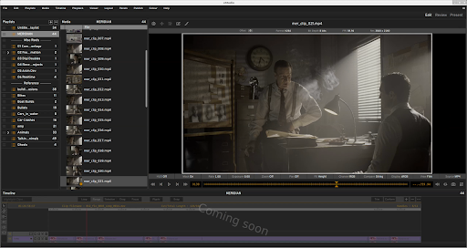

============
Introduction
============

What is xSTUDIO? 
****************

xSTUDIO is a media playback and review application designed for professionals working in the film and TV post production industries, particularly the Visual Effects and Feature Animation sectors. xSTUDIO is focused on providing an intuitive, easy to use interface with a high performance playback engine at its core and C++ and Python APIs for pipeline integration and customisation for total flexibility.

xSTUDIO is optimised to import and handle very large collections of media sources rapidly, loads specialised image formats and displays images with colour management. Users can quickly import, organise and group media into playlists and 'subsets', playing through and looping on media items and adding review notes and sketched annotations, allowing one to view the media in a highly interactive and collaborative way. This enables workflows that are essential for teams in VFX, animation and other post-production activities who need to see, on demand, the artwork that they and their colleagues are creating. For example one can jump between the viewed media source instantaneously, inspect pixels close-up, do frame-by-frame comparisons across multiple media sources, annotate the media with drawings and captions or add feedback notes to share.

Current Version: v0.10 (alpha) - Overview
*****************************************

This version of the application is a robust and high performance playback and review solution. xSTUDIO has been deployed at DNEG since September 2022 and is in daily use by thousands of VFX and Animation artists, supervisors and producers across our global teams to conduct image reviews.

The development phase is still in full swing as work continues on some major features. Planned work includes adding a non-linear editing timeline interface and enabling network synchronised review sessions across multiple, remote, instances of the application. This means that significant parts of the code base are still evolving. As such, and while we continue to add better documentation, examples and tests, this version should be considered as a preview release.

Here are some key features for users that are available now:

**Loading Media**

  - Display virtually any image format in common use today (EXR, TIF, JPG, MOV, MP4 etc).
  - Drag and drop media from the desktop file system browser directly into the xSTUDIO interface.
  - Use the command line interface to 'push' media into a running xSTUDIO instance from a terminal window.
  - Use the Python API to build playlists with your own custom scripts.
  - Basic audio playback for sources with an embedded sound track is provided.

**Playlists**

  - Create any number of playlists, colour code and arrange them under category headers.
  - Drag and drop to reorder and organise media and playlists.
  - Colour code individual media and playlists with the 'flags' feature.
  - Nest mini-playlist 'subsets' under parent playlists to further structure your viewables.

**Notes**

  - Add notes and annotations to media on individual frames or range of frames.
  - On screen annotations can be created with easy to use, highly responsive sketching tools. Annotations features currently include:
    1. Adjustable colour, opacity and size of brush strokes. 
    2. Shapes tool for boxes, circles, lines and arrows etc. 
    3. Eraser pen for even more sketching flexibility .
    4. Editable text captions with adjustable position, scale, colour and opacity.
    5. 'Snapshot' button allows you to save an annotation to disk as a jpeg /tiff etc image. 
  - Navigate your media collection through the notes interface by jumping directly to bookmarked frames.

**The Viewer**

  - Colour accurate display (OCIO v2 colour management).
  - Hotkey driven interaction.
  - Adjust exposure and playback rate.
  - Zoom/pan image tools, RGBA channel display.
  - A/B and String 'Compare Modes'.
  - Adjustable masking overlay and guide-lines.
  - 'Pop-out' 2nd viewer for dual display set-ups.
  - Audio playback for sources containing embedded audio streams.

**API features for pipeline developers**

*C++ API*

  - Write plugins with full access to the application's internal components down to the lowest level if desired.
  - C++ base classes for creating viewport overlays are available. The on-screen sketching tools are implemented as a plugin, for example, showing how flexible this interface is.
  - C++ base classes for adding metadata to media on creation are available. Use these to inject your own colour management and production status metadata, for example.
  - Code for DNEG's powerful Shotgrid browser interface, exploiting the Shotgrid REST API, is also included for reference. It is written for DNEG's proprietary Shotgrid table schemas and won't work 'out of the box' but developers could adapt the code to work at other studios if desired.

*Python API*

  - Connect to an xSTUDIO instance transparently from a separate process via the Python API - thus xSTUDIO can be run in a separate software environment to an application, controlling it through the API.
  - An embedded python interpreter is also available to execute scripts within xSTUDIO. This runs in a separate thread to the UI so python execution will not affect GUI interactivity or playback.
  - Create and build media playlists through straightforward API methods.
  - Access the 'playhead' to control playback (start, stop, step frame, jump position etc).

What can I expect from future releases?
***************************************
Many more exciting features are planned for upcoming releases, including:

  - Multi-track NLE timeline with auto-conform
  - Session-syncing for collaborative review sessions
  - Colour-correction and image-transform tools (rotate/move/scale etc)
  - Blackmagic and Kona SDI output card support
  - Fully fleshed out API examples, unit tests and code documentation.