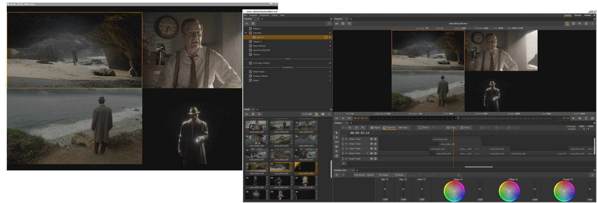
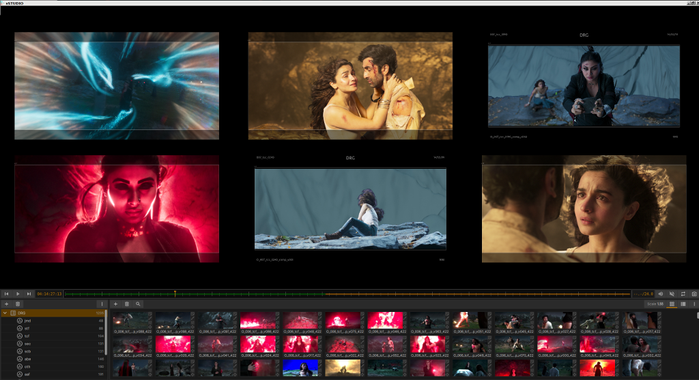

============
Introduction
============

    xSTUDIO Dual Window Interface

What is xSTUDIO?
****************

xSTUDIO is a media playback and review application for film, episodic, VFX,
animation, and other post-production workflows. It combines a high-performance
playback engine with review tools, timeline editing, colour-managed viewing,
and both C++ and Python extension points for studio integration.

xSTUDIO is built to handle large collections of media quickly, including image
sequences, movie files, playlists, subsets, contact sheets, and timelines. It
supports drag-and-drop review, rapid compare workflows, notes and annotations,
timeline-focused playback, and colour-accurate display through OCIO-based
colour management.

Core Concepts
*************

The application is organized around a small number of core concepts:

* A **Session** is the overall review workspace.
* **Playlists** group media for review and can contain **subsets**,
  **contact sheets**, and **sequences**.
* The **Media List** shows the contents of the currently inspected container.
* The **Viewport** is where media is displayed, compared, graded, and
  annotated.
* A **Sequence** is xSTUDIO's timeline container for editorial-style review
  and export.

xSTUDIO Overview
****************

Here are the major capabilities that the current codebase and documentation
cover.

**The Interface**

  - The application interface is highly flexible and configurable.
  - Multiple layouts let you switch between different panel arrangements as you
    work.
  - Panels can be shown, hidden, or rearranged to support focused viewing,
    timeline editing, or broader review sessions.

**Loading Media**

  - Load common image and movie formats, including image sequences and
    high-resolution review media.
  - Drag and drop media from the desktop directly into playlists or the media
    list.
  - Use the command line to push media into a running xSTUDIO session.
  - Use the Python API to build playlists and sessions programmatically.

**Playlists**

  - Create any number of playlists and arrange them under category headers.
  - Reorder playlists and media with drag and drop.
  - Flag media and playlists for quick visual organization.
  - Use subsets and contact sheets to structure and compare large groups of
    shots.

**Sequences**

  - Create multi-track timelines by dragging media from playlists into the
    timeline.
  - Edit video and audio arrangements with xSTUDIO's sequence tools.
  - Import and export timelines through OpenTimelineIO.
  - Use review-focused tools such as focus mode, looping, and timeline-aware
    playhead control.

**Notes**

  - Add notes and annotations on individual frames or over frame ranges.
  - Use drawing, shapes, arrows, text, and snapshots to capture review
    feedback.
  - Navigate review material by jumping directly to bookmarked frames.

    xSTUDIO's Contact Sheet viewer mode

**The Viewer**

  - Colour-accurate display with OCIO v2 colour management.
  - Hotkey-driven playback and navigation.
  - Exposure, gamma, and channel-view controls.
  - Zoom, pan, masking, guides, and detailed pixel inspection.
  - Compare modes including grid, A/B, wipe, composite, and string-out.
  - Audio playback for sources with embedded audio streams.
  - Optional pop-out or quick-view style viewing for focused inspection.

**Other Capabilities**
  - Apply creative grades to shots and renders with the grading tool.
    - Grades can be masked with editable polygon shapes
    - Grade masks can be softened
    - Export a grade to Nuke with a simple copy and paste operation
  - QuickView for instant inspection of individual media items.
    - While xSTUDIO is running, a command-line call can pop out an independent
      light player window for viewing a single piece of media in isolation.

Pipeline Integration
********************

xSTUDIO is designed to be extended as well as used interactively.

*C++ API*

  - Write plugins with direct access to the application's internal actors,
    media pipeline, and viewport systems.
  - The public headers include base classes for video output, viewport overlays,
    viewport layouts, colour pipelines, media readers, media metadata readers,
    data sources, and media hooks.
  - Concrete examples ship in `src/plugin`, including OCIO colour management,
    built-in viewport layouts, HUD overlays, media readers, and DNEG-specific
    data source integrations.

*Python API*

  - Create Python plugins that add UI, interact with the session model, draw
    viewport overlays, and react to playback events.
  - Control a running xSTUDIO instance from an external Python process through
    the same high-level API wrappers used internally.
  - Use the Python API to create playlists, manage timelines, inspect media,
    control playheads, and automate review workflows.
  - Demo scripts and plugin examples ship in `python/src/xstudio/demo` and
    `src/plugin/python_plugins`.
