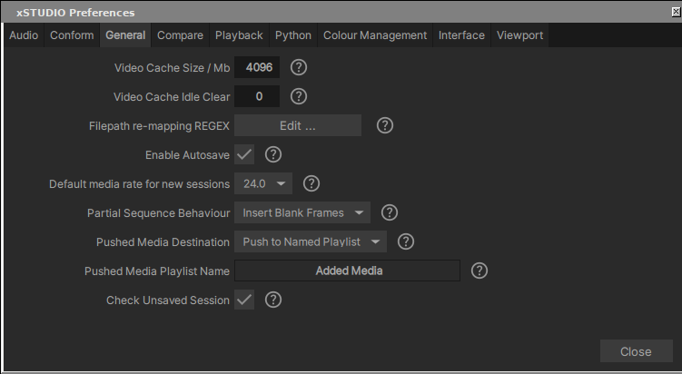

###########
Preferences
###########

The preferences panel can be accessed via the Panels menu in the main menu bar (Settings  option) or by clicking the cog button in the Viewport title bar.

Some of these settings are self explanatory but otherwise a description follows:

    - **Enable presentation mode on Startup:** This option will make xSTUDIO always start in presentation mode so that the Viewer fills the window and the Media List and Playlist panels are hidden. They can still be revealed by switching your layout to ‘Review’ or ‘Edit’ after xSTUDIO has started.
    - **Check unsaved session:** Every time xSTUDIO shuts down, it will ask you if you want to save your session if it hasn’t already been saved. This can be undesirable if you use xSTUDIO as a ‘light player’, opening and closing it frequently to view individual pieces of media. Use this option to turn off the behaviour.
    - **Load Additional Media Sources:** Option is unused in this version of xSTUDIO.
    - **Pause Playback After Scrubbing:** When xSTUDIO is playing media you can left-mouse-button click and hold in the viewport and scrub the mouse left/right to scrub the frame range - on releasing the mouse playback will continue or pause, depending on this setting.
    - **Mouse wheel behaviour:** Option to use the mouse wheel to scrub forwards/backwards in the timeline or to zoom in/out of the image.
    - **Frame Scrubbing Sensitivity:** For left mouse button click+drag frame scrubbing. Set the sensitivity of the time scrub to mouse movement.
    - **UI Accent Colour:** Which colour is used for highlighted UI elements.
    - **New Image Sequence Frame Rate:** For frame based media (like numbered EXR or JPEG sequences) this is the default playback frame rate applied.
    - **Audio Latency:** A higher number here means audio will be sounded further ‘behind’ the image. Due to the size of the audio sample buffer if you make the value too large (or negative) it may affect audio quality or you may get no sound at all.
    - **Image Cache (MB):** Set the size of xSTUDIO’s image cache here. See the section ‘Playhead Caching Behaviour’ for more information.
    - **Viewport Pixel Filtering:** Options are as follows
        1. **Nearest pixel:** Shows individual pixels. Depending on the image content, how much the image is zoomed and your screen resolution, you may see aliasing artifacts (a faint grid-like pattern) across the Viewer.
        2. **Bilinear:** Applies simple smooth blending between neighbouring pixels to reduce the aliasing artefacts. However, when zoomed into an image it introduces a softness and individual pixels cannot be identified.
        3. **Auto Nearest/Bilinear:** Applies bilinear filtering when the image is zoomed out less than 1:1 (i.e. more than one image pixel fits into a screen pixel). Otherwise (when zoomed in) the nearest pixel filter is used.
    - **Viewport Texture Mode:** Changes a low level setting controlling how image data is transferred to your graphics card. We have found out that on some systems, particularly ones using NVIDIA grid GPU technology, the ‘Image Texture’ setting performs better. On others, the ‘SSBO’ setting allows smoother playback for very high resolution media. If you experience a stuttering playback experience (for video frames that are already cached) try changing this setting.

