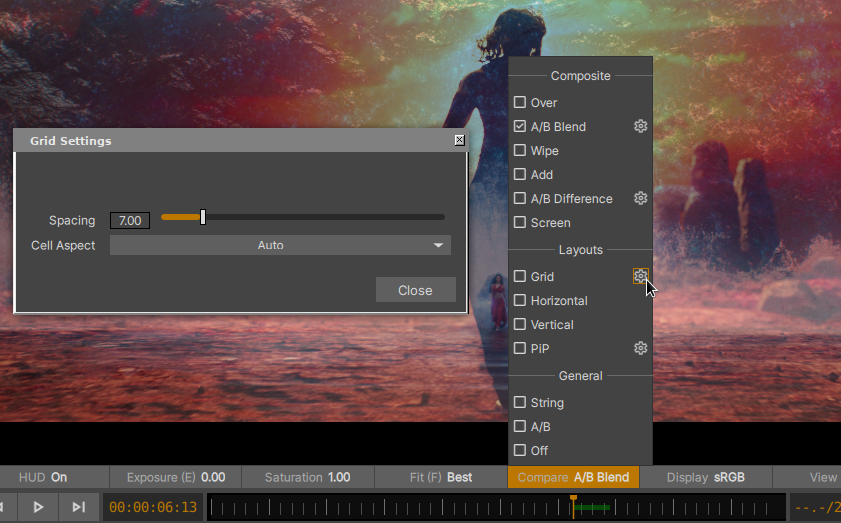

.. _compare_modes:

Compare Modes
=============

    The xSTUDIO Compare Modes Menu

The toolbar button labelled 'Compare' sets the compare mode for the Playhead of the current viewed Playlist/SubSet/Contact Sheet or Sequence. Understanding xSTUDIO's simple compare workflow is important for getting the most out of the application.

.. list-table:: Compare Modes Summary
    :width: 90 %
    :align: left
    :header-rows: 1
    :stub-columns: 1

    * - Compare Mode
      - Description
    * - Off
      - Only the first compare media item / video track is displayed in the Viewport
    * - A/B
      - All items being compared are loaded and frame numbers are aligned. *Only one item is shown in the viewport at any time*. To cycle through which item is shown use the 1 ... 9 numeric keys or Up/Down arrow keys. It should be possible to instantaneously switch the on-screen source in this mode to assist with direct visual comparison.
    * - String
      - All items being compared are 'strung' together in time so that they play in a sequence in the order that they are selected. This mode has no effect if you are viewing a Sequence.
    * - Grid
      - Media being compared is automatically arranged in a grid in the Viewport. The layout ordering is left-to-right then top-to-bottom. Hit the settings button against the Grid menu option to modify the spacing between grid tiles and the Aspect value used to arrange the items
    * - Horizontal
      - Like Grid mode but images are arranged in a single row
    * - Vertical
      - Like Grid mode but images are arranged in a single column.
    * - Wipe
      - A pair of images can be compared by wiping between them with an on-screen handle that can be dragged with the mouse pointer. The Numeric keys 1,2...9 can be used to select which 2 images are being compared when more than 2 items are selected for comparison (or you have a Contact Sheet with more than 2 items or a Sequence (Timeline) with more than 2 visible video tracks).
    * - A/B Difference
      - Like A/B mode, where 2 images from the set of images being compared are composited as a Luminance image showing the pixel value of the **A** image minus the pixel value of the **B** image.
    * - A/B Blend
      - Like A/B mode, where 2 images from the set of images being compared are composited with a simple blend operation.
    * - Add
      - All images from the set of images being compared are composited with a simple add operation.
    * - Over
      - All images from the set of images being compared are composited with an 'Over' operation. This is only useful if the top images in the compare stack have an alpha channel with an appropriate mask. This option could be particularly powerful when used in a Squeunce where Track 2, say, will be composited over Track 1 so some foreground item could be loaded into Track 2 with background images in Track 1.
    * - Screen
      - All images from the set of images being compared are composited with a screen operation.

.. note::
    You can select any number of items to compare. How does this play with A/B or Wipe modes, for example, where two images are being viewed? The answer is that you can cycle between which images are compared with the 1,2...9 numeric keys (on the main Kewyboard, not the number pad). If you have 8 items to compare, and you want to cycle between item 4 and 5, just hit the 4 & 5 keys.

Comparing Media in Playlists and Subsets
----------------------------------------

*For an intro to Playlists, Subsets and Contact Sheets see the :ref:`Playlists Interface <_playlist_panel>` section.*

Image comparison in Playlists and Subsets is *dynamically driven* by the selection state of the media within. The media items that are selected via the :ref:`Media List Panel <_media_list_panel>` are loaded for comparison according to your current Compare Mode. The order in which the media items are selecteds dictates the ordering for the Compare Mode. So if you use the 'Over' mode, for example, and select the 11th media item and *then* the 10th media item the Media List, the 11th item will be composited over thed 10th item in the Viewport.

Comparing Media in Contact Sheets
---------------------------------

Contact Sheets differ to Playlists and Subsets only in that *all of the media in the Contact Sheet* is loaded for comparison, regardless of the selection state of the media items. As such, if you want to lay out several media items in the viewport in a grid, for example, you can add those media items to a contact sheet and set the Compare Mode to 'grid'. Viewing the Contact Sheet will then give you that grid view.

Comparing Media in Sequences (Timelines)
----------------------------------------

xSTUDIO's Compare Mode system provides some useful features when applied to a multi-track edit: 

    * When the Comapare Mode is set to **Off** the Viewport will only display the bake-down of the timeline edit such that the topmost visible track will provide the video at any given frame in the timeline.
    * When the Compare Mode is set to **something other than Off** each active video track will be individually loaded for comparison. Thus, if your Compare Mode is set to *Grid*, for example, and your Sequence has 4 separate video tracks, you will see a grid layout of 4 images in the viewport. Each image is the current frame of the respective video tracks.

.. note::
    Comparing media in modes other than *Off* or *String* your computer will be working harder during playback as it is decoding and storing frames for all of your selected media/video tracks at the same time. xSTUDIO is optimised to get the most out of your system and in many cases you may be able to compare several sources without imapcting performance, but if you try to compare too many sources at once playback performance may eventually be affected.

Compare Modes Walkthrough
-------------------------------------

This short video demonstrates compare modes in action (a non-exhaustive demo!)

.. raw:: html
    
    
<video src="../../_static/compare-modes-01.webm" width="720" height="366" controls></video>

