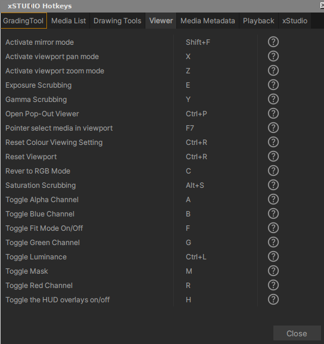

.. _hotkeys:

Hotkeys
=======

xSTUDIO's interface can be extensively deriven by hotkeys (keyboard shortcuts) for users that prefer this way of working with Appliations. Hotkey use is entirely optional, however, as there are no interactions that can't be achieved through the interface via buttons or menus. 

xSTUDIO's hotkey shortcuts can be viewed from the *Help->Hotkeys* panel where all the hotkeys can be discovered along with descritions of what they do.

    The Shortcuts Help Panel is where you can discover all Hotkeys configured

.. note::  Hotkeys will be fully user-configurable in upcoming releases.
