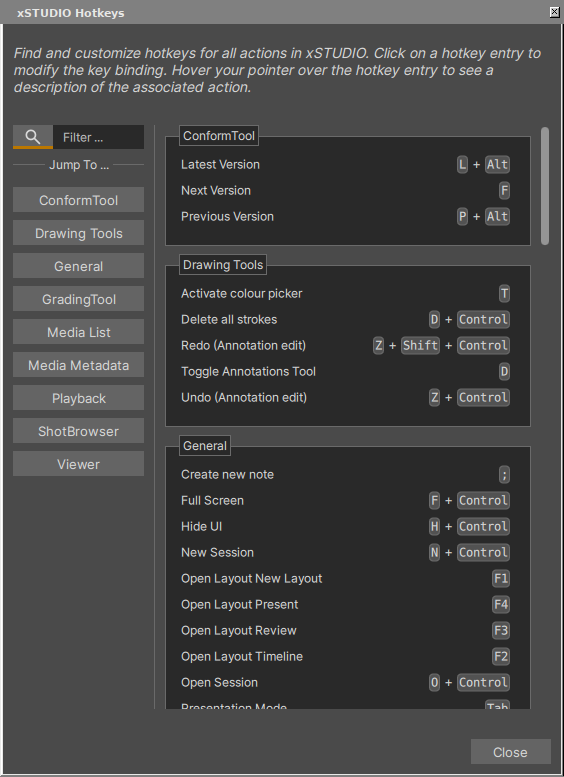
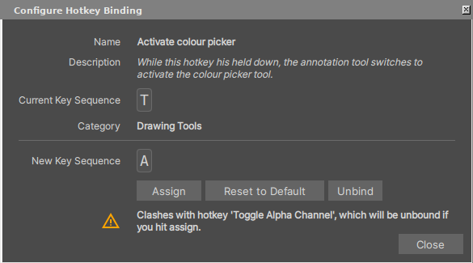

.. _hotkeys:

Hotkeys
=======

xSTUDIO's interface can be extensively deriven by hotkeys (keyboard shortcuts) for users that prefer this way of working with appliations. Hotkey use is entirely optional, however, as there are no interactions that can't be achieved through the interface via buttons or menus. Hotkeys are fully user-configurable, meaning you can set-up your preferred hotkey combinations for any of the available actions in xSTUDIO.

xSTUDIO's hotkey shortcuts can be viewed and configured from the *Help->Hotkeys* panel. The panel provides a list of all available hotkey-driven actions with buttons to navigate to the relevant interface element for each action and a search field to quickly find the action you want to set a hotkey for. 

    The Hotkeys Dialog is where you can discover all Hotkeys and customise the key bindings to suit your workflow.

To configure a hotkey, click on the entry for it in the list to show the hotkey setter dialog. The dialog will show the current hotkey for the action, if it has one, and allow you to set a new one. To set a new hotkey, simply press the key combination you want to use while the dialog is open. If the key combination is already in use by another action, you will be informed of the conflict. If there is a conflict and you choose to assign anyway, the other action will be unbound from the hotkey to ensure there are no clashes. You can also re-set the hotkey to its default key combination if desired.

    The Hotkeys Setter Dialog is where you can configure the key bindings for a specific hotkey.
