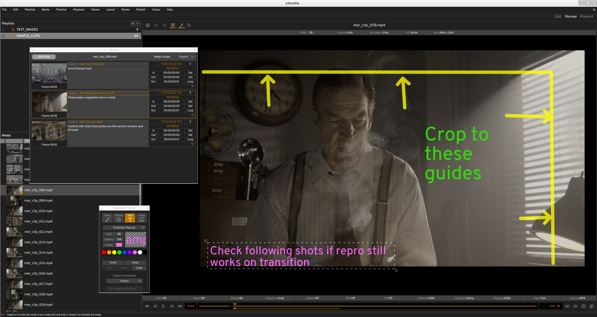
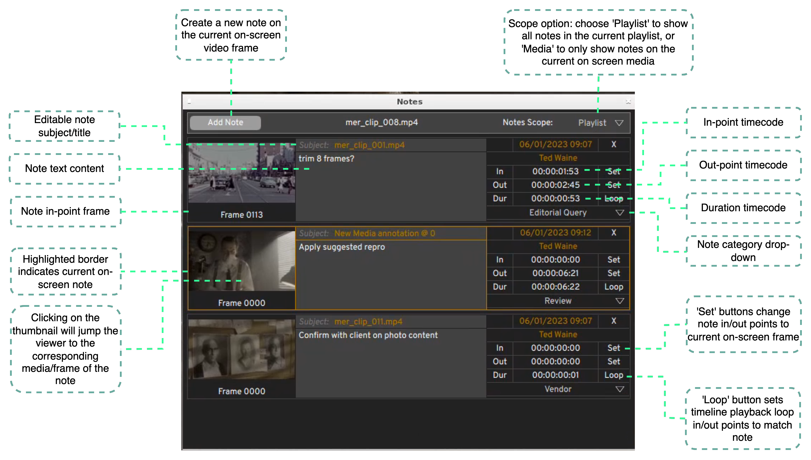

.. _notes:

Notes and Annotations
=====================

   xSTUDIO Annotations in Action

xSTUDIO's notes features provide a quick and easy way to tag media with text comments and on-screen sketches. This allows users to record and share written and visual feedback with colleagues or make annotations for their own use.

Notes can also be useful as empty bookmarks to mark a frame or range of frames of interest on a media item. The notes panel can then be used as a shortcut tool to jump between and loop over these frames during a review.

   The Notes panel

Adding a Note
-------------

There are three ways to create a note on any frame of a media item. The note is always added to the current (on screen) frame of the on-screen media:

    - Hit the ';' key to immediately create an empty note on the current frame.
    - Hot the 'N' hotkey (or click the notes button to the top left of the Viewer) to show the Notes interface. Hit the 'Add Note' button in the notes interface.
    - Hit the 'D' hotkey to show the Annotation Tool toolbox. Start drawing strokes or shapes over the image in the viewer - this will automatically create a note on the frame.

On-screen sketches are always attached to the current note for a given frame. If there is no note when you start creating a sketch, an empty note will be created.

Modifying a Note
----------------

* Enter your notes text content directly into the note in the Notes interface. 
* Click on the 'subject' box to change the note subject/title.
* Use the 'set' buttons on the In/Out points to extend the note duration and/or move its position in the media frame range.
* The note category can be selected from the dropdown. The categories that show in the dropdown are configurable (see Appendix section on Preferences).
* To *delete* a note, right click on it and select 'Remove Note' or hit the 'X' button at the top right of the note entry.

Navigating Notes
----------------

The presence of a note is indicated in the bottom half of the transport bar timeline. The colour of the indicator matches the colour associated with the node category.
The , and . keys on your keyboard will jump the playhead to the previous or next note on the timeline.
In the notes pane you can switch the 'scope' between Playlist or Media. The 'playlist' option will show all notes within the current playlist. The 'Media' option will only show notes on the current (on-screen) media item.
Click on the thumbnail of a note in the Notes Pane to switch to the corresponding media and pane.
Click the 'Loop' button on a note in the Notes Pane to set the playhead loop in/out points to match the note duration. 

Drawing Annotations
-------------------

.. raw:: html
    
   
<video src="../../_static/annotations-01.webm" width="720" height="366" controls></video>

|

The Drawing Tools box can be shown or hidden with the 'D' hotkey or by clicking the button with the pen icon to the top left of the viewer. xSTUDIO's drawing tools should be easy to get to grips with - just start drawing strokes, shapes or text captions directly onto the viewer. As noted above, a 'note' is always created when you create a new annotation.

Drawings are 'vector based' (rather than rasterised pixels) and they are rendered 'on the fly' by the graphics card. You can zoom in and out of the viewport and the brush strokes should always render without pixellation. Drawings can extend outside of the image boundaries so you are free to add sketches to the side or above and below the image if preferred.

The 'Laser' freehand draw mode is provided so that you can draw non-persistent strokes that fade until they disappear over a couple of seconds. This can be useful for highlighting an area of the image to colleagues present in a review without you needing to continually erase or undo your strokes.

To enter a text caption, select the 'Text' tool, click in the viewport to place the caption and start typing. The handles in the corner of the caption box allow you to move and scale the box. Text captions can be placed, resized, coloured and scaled during and after entering your text.

.. note::
    When drawing annotations you can pick a colour from the image for the pen strokes. Use the **default shotcut key 'V'** to activate the colour picker, click on the image and then continue drawing with the new colour. The picker can be set to take the colour of the pixwel under the pointer or to compute the average pixel value as the pointer is dragged around an area (with the mouse button held down).

